# REST Server v2 — 엔터프라이즈 아키텍처 문서

## 📋 목차
1. [시스템 개요](#시스템-개요)
2. [아키텍처 원칙](#아키텍처-원칙)
3. [시스템 아키텍처](#시스템-아키텍처)
4. [프로젝트 구조](#프로젝트-구조)
5. [보안 아키텍처](#보안-아키텍처)
6. [데이터 아키텍처](#데이터-아키텍처)
7. [이벤트 기반 아키텍처](#이벤트-기반-아키텍처)
8. [성능 최적화](#성능-최적화)
9. [배포 아키텍처](#배포-아키텍처)
10. [관측성 스택](#관측성-스택)
11. [CI/CD 파이프라인](#cicd-파이프라인)
12. [확장 패턴](#확장-패턴)
13. [재해 복구](#재해-복구)
14. [품질 속성](#품질-속성)

---

## 시스템 개요

### C4 컨텍스트 다이어그램

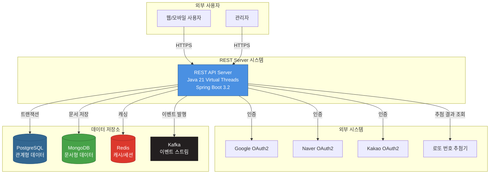

### 주요 특징

- **Java 21 Virtual Threads**: 10,000+ 동시 연결 처리
- **Clean Architecture**: Hexagonal Architecture / Ports & Adapters 패턴
- **Domain-Driven Design**: 순수 도메인 모델 중심 설계
- **Test-Driven Development**: 단위/통합/슬라이스 테스트
- **OAuth2 소셜 로그인**: Google, Naver, Kakao 지원
- **Polyglot Persistence**: PostgreSQL, MongoDB, Redis, Kafka
- **Event-Driven Architecture**: Kafka 기반 이벤트 스트리밍
- **Kubernetes 배포**: 3-50 Pod 오토스케일링
- **Comprehensive APIs**: 사용자 관리, 로또/연금복권 APIs

---

## 아키텍처 원칙

### 1. 의존성 규칙 (Dependency Rule)

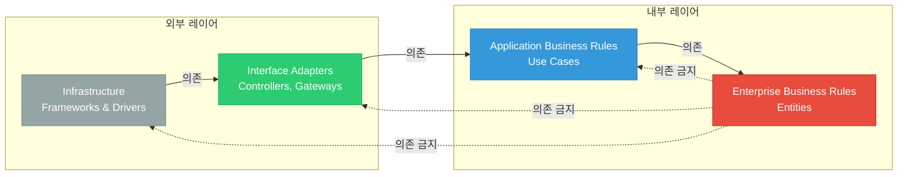

### 2. Hexagonal Architecture

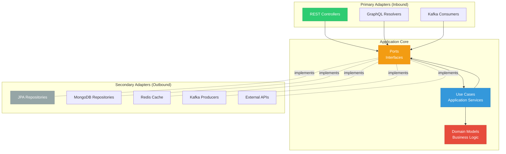

---

## 프로젝트 구조

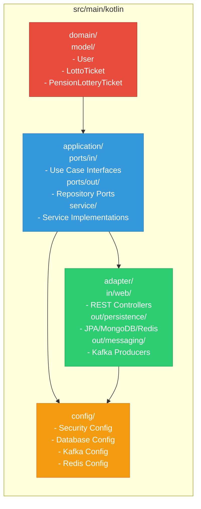

### 디렉토리 구조

```
src/main/kotlin/yousang/rest_server/
├── domain/                           # 도메인 레이어 (순수 비즈니스 로직)
│   └── model/
│       ├── User.kt                   # 사용자 도메인 모델
│       ├── LottoTicket.kt           # 로또 티켓 도메인 모델
│       ├── PensionLotteryTicket.kt  # 연금복권 티켓 도메인 모델
│       ├── LottoDrawResult.kt       # 로또 추첨 결과
│       └── PensionLotteryDrawResult.kt
│
├── application/                      # 애플리케이션 레이어 (유스케이스)
│   ├── ports/
│   │   ├── in/                      # Inbound Ports (Use Cases)
│   │   │   ├── CreateUserUseCase.kt
│   │   │   ├── GenerateLottoNumbersUseCase.kt
│   │   │   ├── GeneratePensionLotteryNumbersUseCase.kt
│   │   │   ├── CheckLotteryWinningUseCase.kt
│   │   │   ├── GetLotteryTicketsUseCase.kt
│   │   │   └── GetLotteryDrawResultsUseCase.kt
│   │   └── out/                     # Outbound Ports (Repository/Gateway Interfaces)
│   │       ├── UserRepositoryPort.kt
│   │       ├── LottoTicketRepositoryPort.kt
│   │       ├── PensionLotteryTicketRepositoryPort.kt
│   │       ├── LottoDrawResultRepositoryPort.kt
│   │       ├── PensionLotteryDrawResultRepositoryPort.kt
│   │       ├── UserCachePort.kt
│   │       └── EventPublisherPort.kt
│   └── service/                     # Service Implementations
│       ├── UserService.kt
│       └── LotteryService.kt
│
├── adapter/                          # 어댑터 레이어 (인프라/프레임워크)
│   ├── in/
│   │   └── web/                     # REST Controllers
│   │       ├── UserController.kt
│   │       ├── AuthController.kt
│   │       ├── LottoController.kt
│   │       └── PensionLotteryController.kt
│   ├── out/
│   │   ├── persistence/
│   │   │   ├── jpa/                # PostgreSQL JPA
│   │   │   │   ├── UserJpaEntity.kt
│   │   │   │   ├── UserJpaRepository.kt
│   │   │   │   ├── UserRepositoryAdapter.kt
│   │   │   │   ├── LottoTicketJpaEntity.kt
│   │   │   │   ├── LottoTicketJpaRepository.kt
│   │   │   │   └── LottoTicketRepositoryAdapter.kt
│   │   │   ├── mongodb/            # MongoDB
│   │   │   │   ├── UserMongoDocument.kt
│   │   │   │   └── UserMongoRepository.kt
│   │   │   └── redis/              # Redis Cache
│   │   │       └── RedisCacheAdapter.kt
│   │   └── messaging/
│   │       └── kafka/               # Kafka Event Publisher
│   │           └── KafkaEventPublisher.kt
│   └── security/
│       └── oauth2/
│           ├── CustomOAuth2UserService.kt
│           ├── OAuth2AuthenticationSuccessHandler.kt
│           └── OAuth2AuthenticationFailureHandler.kt
│
└── config/                           # 설정 클래스
    ├── SecurityConfig.kt
    ├── JpaConfig.kt
    ├── MongoConfig.kt
    ├── RedisConfig.kt
    ├── KafkaConfig.kt
    └── WebConfig.kt
```

---

## 보안 아키텍처

### 다층 보안 모델

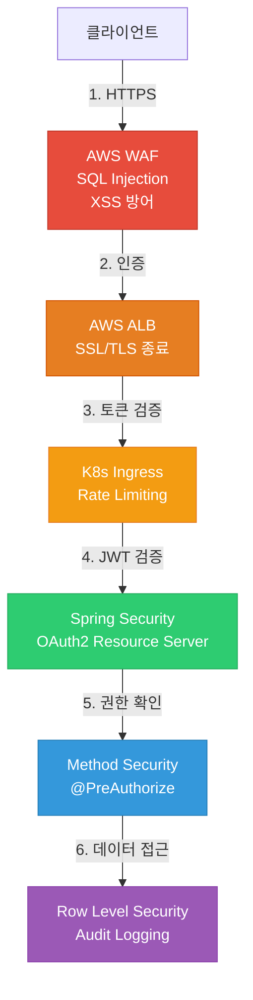

### OAuth2 인증 플로우

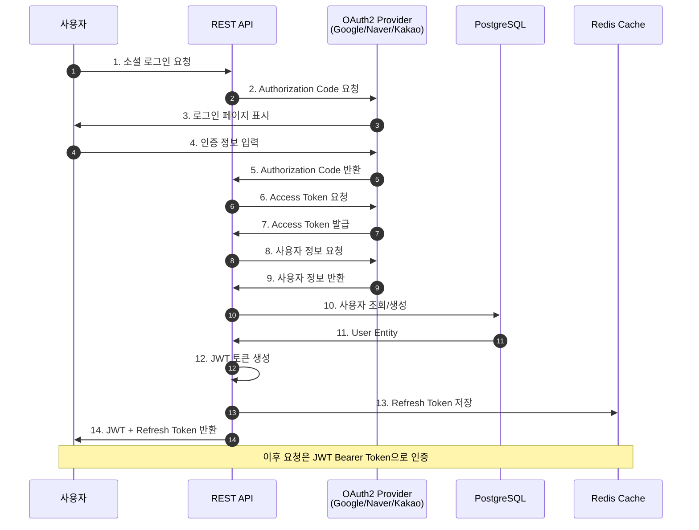

### 보안 기능

- **OAuth2 소셜 로그인**: Google, Naver, Kakao
- **JWT 토큰 기반 인증**: Access Token (15분) + Refresh Token (7일)
- **Spring Security**: Method-level @PreAuthorize 권한 검증
- **Rate Limiting**: Redis 기반 API 호출 제한 (100 req/min per user)
- **CORS 설정**: 허용된 도메인만 접근 가능
- **HTTPS Only**: TLS 1.2+ 강제
- **Password Encryption**: BCrypt (strength 12)
- **SQL Injection 방어**: Prepared Statements (JPA)
- **XSS 방어**: Content Security Policy, X-XSS-Protection
- **CSRF 방어**: Double Submit Cookie Pattern
- **Audit Logging**: 모든 인증/인가 이벤트 기록

---

## 데이터 아키텍처

### Polyglot Persistence 전략

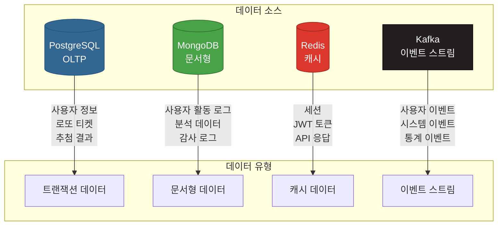

### 데이터 플로우

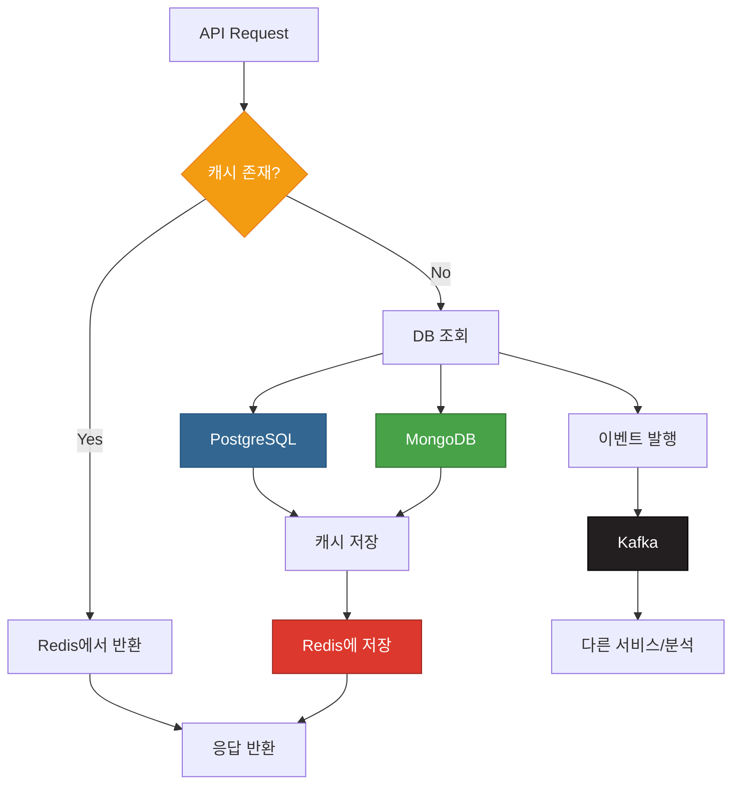

### 데이터베이스 설계

**PostgreSQL 스키마**:
- **users**: 사용자 기본 정보 (id, email, name, oauth2_provider)
- **lotto_tickets**: 로또 티켓 (id, user_id, draw_number, numbers, purchase_date)
- **pension_lottery_tickets**: 연금복권 티켓 (id, user_id, draw_number, group, number)
- **lotto_draw_results**: 로또 추첨 결과 (draw_number, winning_numbers, bonus_number, draw_date)
- **pension_lottery_draw_results**: 연금복권 추첨 결과

**MongoDB 컬렉션**:
- **user_activities**: 사용자 활동 로그 (user_id, action, timestamp, metadata)
- **audit_logs**: 감사 로그 (user_id, action, resource, timestamp)
- **analytics**: 분석 데이터 (user_id, event_type, data)

**Redis 키 패턴**:
- **session:{sessionId}**: 세션 데이터 (TTL: 30분)
- **user:{userId}**: 사용자 정보 캐시 (TTL: 15분)
- **lottery:draw:{drawNumber}**: 추첨 결과 캐시 (TTL: 24시간)
- **ratelimit:{userId}**: Rate Limiting 카운터 (TTL: 1분)

---

## 이벤트 기반 아키텍처

### Event Sourcing 패턴

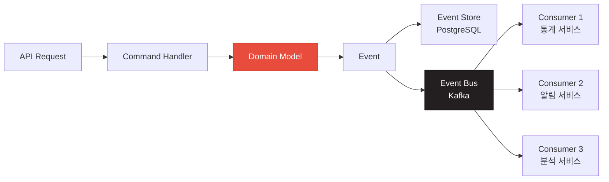

### Kafka Topics

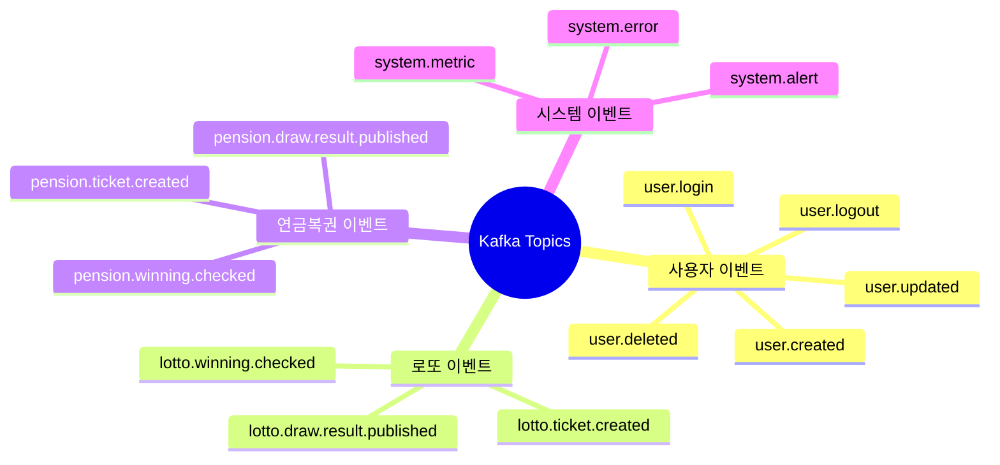

### 이벤트 처리 플로우

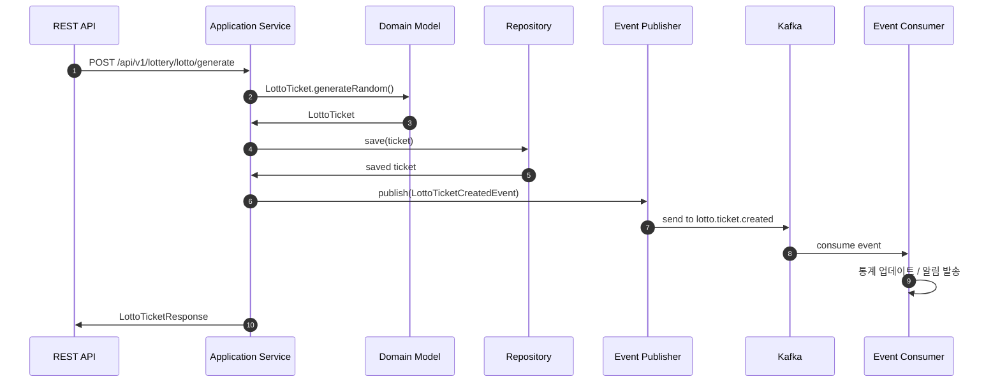

---

## 성능 최적화

### Virtual Threads & 연결 풀 최적화

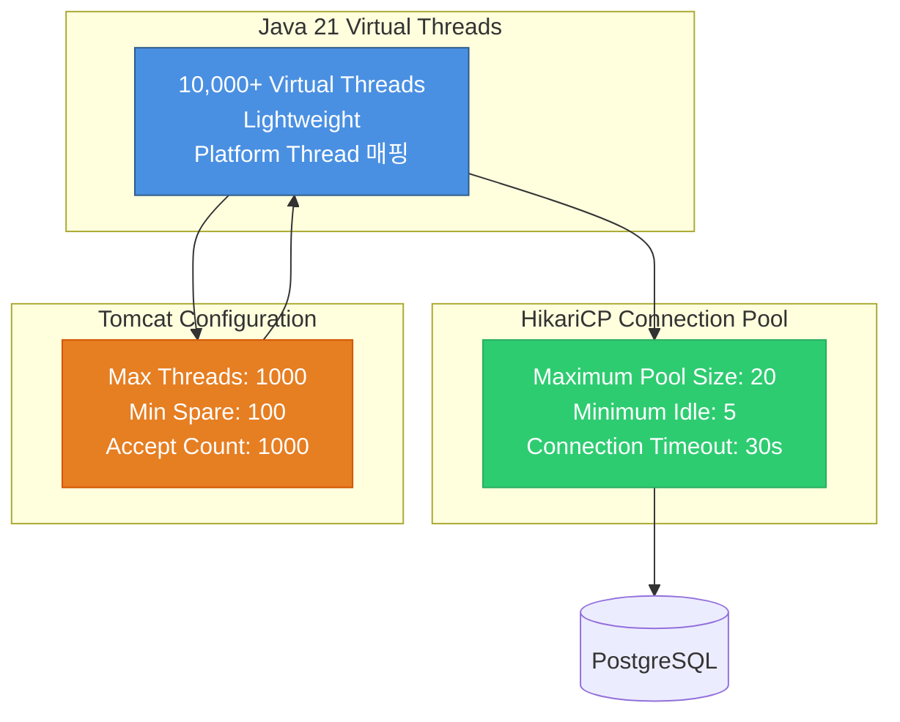

### 캐싱 전략

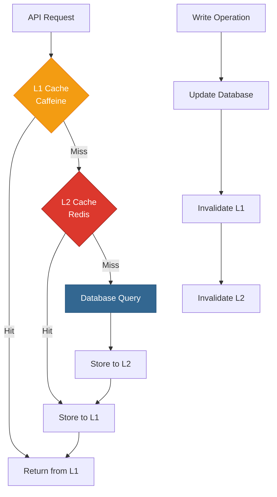

### 성능 최적화 기법

1. **Virtual Threads**: Java 21의 경량 스레드로 10,000+ 동시 연결 처리
2. **HikariCP**: 최적화된 JDBC 연결 풀 (maximum-pool-size: 20)
3. **Hibernate 최적화**:
   - `hibernate.jdbc.batch_size=50`: 배치 쓰기
   - `hibernate.order_inserts=true`: 삽입 순서 최적화
   - `hibernate.order_updates=true`: 업데이트 순서 최적화
4. **Redis 캐싱**:
   - L1 Cache: Caffeine (로컬 메모리)
   - L2 Cache: Redis (분산 캐시)
   - TTL: 사용자 정보(15분), 추첨 결과(24시간)
5. **데이터베이스 인덱싱**:
   - B-Tree Index: PK, FK, 검색 컬럼
   - Composite Index: 복합 조건 쿼리
6. **응답 압축**: Gzip (>1KB 응답)
7. **비동기 처리**: @Async, CompletableFuture
8. **읽기 전용 트랜잭션**: @Transactional(readOnly=true)

---

## 배포 아키텍처

### Kubernetes Multi-Pod 배포

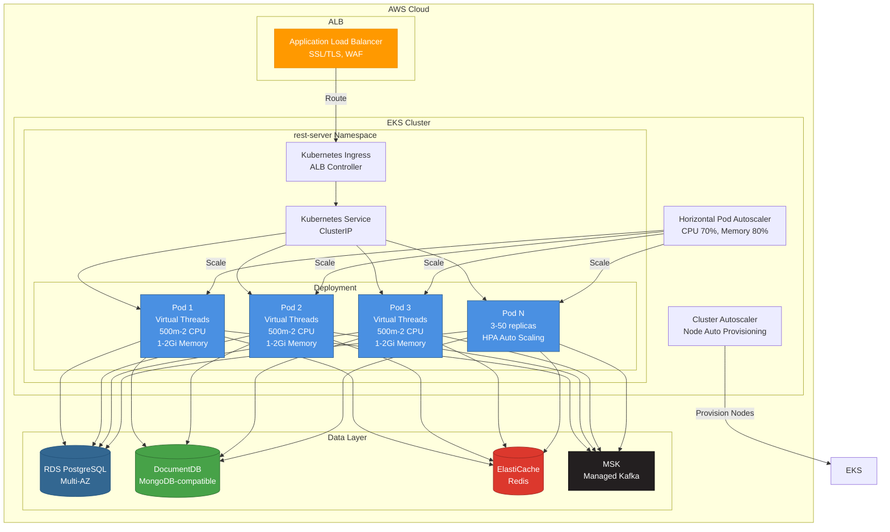

### 배포 전략

- **Rolling Update**: maxSurge=2, maxUnavailable=1
- **Health Checks**:
  - Liveness Probe: `/actuator/health/liveness` (initialDelay=60s, period=10s)
  - Readiness Probe: `/actuator/health/readiness` (initialDelay=30s, period=5s)
  - Startup Probe: `/actuator/health/startup` (failureThreshold=30, period=10s)
- **Pod Disruption Budget**: minAvailable=2 (고가용성 보장)
- **Pod Anti-Affinity**: preferredDuringSchedulingIgnoredDuringExecution (노드 분산)
- **Resource Requests/Limits**:
  - Requests: cpu=500m, memory=1Gi
  - Limits: cpu=2000m, memory=2Gi

---

## 관측성 스택

### Monitoring Architecture

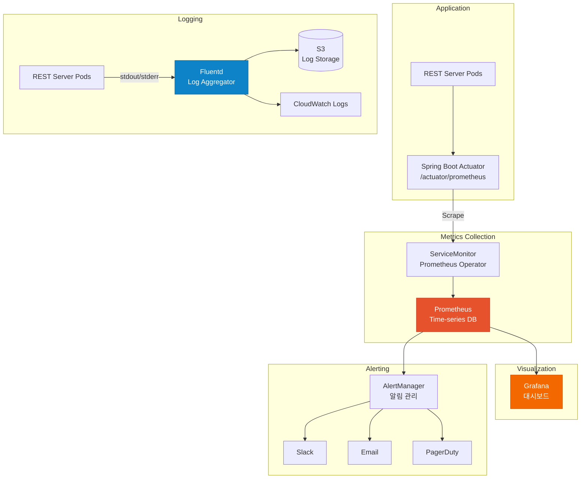

### 주요 메트릭

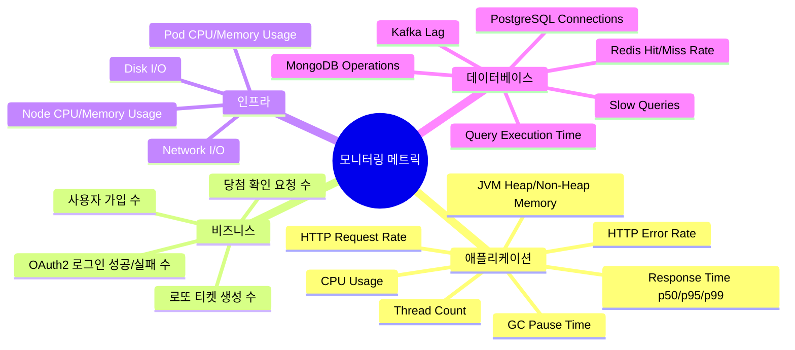

### Alert Rules

- **HighErrorRate**: HTTP 5xx > 5% for 5분
- **HighMemoryUsage**: Memory > 90% for 5분
- **PodNotReady**: Pod not ready for 5분
- **DatabaseConnectionPoolExhausted**: Active connections > 95%
- **KafkaConsumerLag**: Lag > 1000 messages for 10분

---

## CI/CD 파이프라인

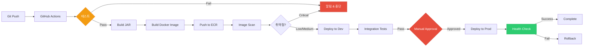

### CI/CD 단계

1. **코드 품질 검증**:
   - Ktlint (코드 스타일)
   - Detekt (정적 분석)
   - JaCoCo (코드 커버리지 > 80%)

2. **테스트**:
   - 단위 테스트 (JUnit 5)
   - 통합 테스트 (Testcontainers)
   - API 테스트 (MockMvc)

3. **빌드**:
   - Gradle bootJar (최적화 빌드)
   - Multi-stage Docker build

4. **보안 스캔**:
   - ECR Image Scan (취약점 검사)
   - Trivy (컨테이너 스캔)

5. **배포**:
   - Dev: 자동 배포
   - Prod: Manual approval 후 배포
   - Blue-Green Deployment

6. **검증**:
   - Health Check (Actuator)
   - Smoke Tests
   - Rollback on failure

---

## 확장 패턴

### Horizontal Scaling (Auto Scaling)

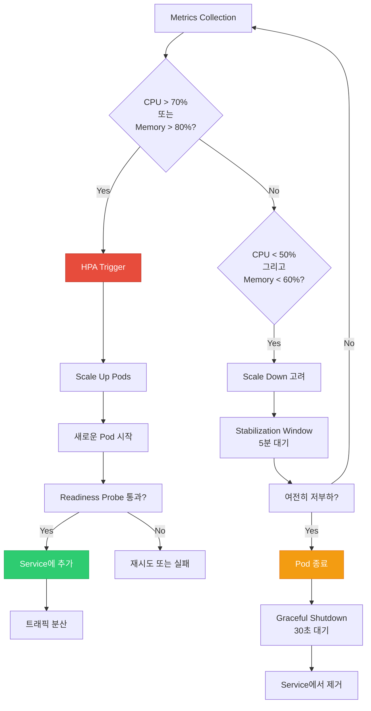

### Cluster Autoscaler

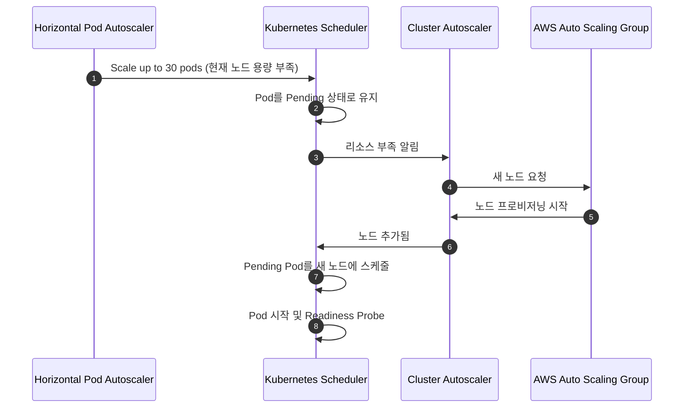

### 확장 한계

- **Pod 수**: 3 (최소) ~ 50 (최대)
- **노드 수**: 2 (최소) ~ 20 (최대)
- **CPU**: Pod당 최대 2 vCPU
- **Memory**: Pod당 최대 2Gi
- **Database Connections**: HikariCP max pool size 20

---

## 재해 복구

### Disaster Recovery 전략

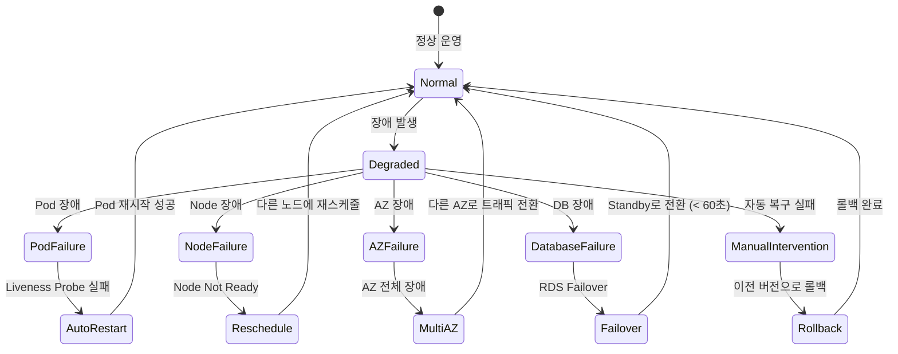

### RTO/RPO 목표

- **RTO (Recovery Time Objective)**: 5분 이내
- **RPO (Recovery Point Objective)**: 1분 이내 (거의 0에 가까움)

### 백업 전략

- **Database**: 자동 백업 (매일), 스냅샷 보관 (30일)
- **Configuration**: Git 버전 관리
- **Docker Images**: ECR 이미지 보관 (최근 10개 버전)
- **Logs**: S3 장기 보관 (90일)

---

## 품질 속성

```mermaid
mindmap
  root((품질 속성))
    성능
      Response Time
        p50 < 100ms
        p95 < 500ms
        p99 < 1000ms
      Throughput
        10,000+ req/sec
      Concurrency
        10,000+ connections
    확장성
      Horizontal Scaling
        3-50 pods
      Vertical Scaling
        500m-2 CPU per pod
      Database Scaling
        Read Replicas
    가용성
      Uptime: 99.9%
      Multi-AZ
      Auto Healing
      Zero Downtime Deployment
    보안
      OAuth2 Authentication
      JWT Authorization
      Rate Limiting
      Encryption at Rest/Transit
    유지보수성
      Clean Architecture
      Test Coverage > 80%
      Monitoring & Alerting
      Comprehensive Documentation
    관측성
      Metrics
        Prometheus
      Logs
        CloudWatch
      Traces
        Distributed Tracing
      Dashboards
        Grafana
```

---

## 기술 스택 요약

| 카테고리 | 기술 |
|---------|------|
| **Language** | Kotlin 1.9 |
| **Runtime** | Java 21 (Virtual Threads) |
| **Framework** | Spring Boot 3.2 |
| **Security** | Spring Security, OAuth2, JWT |
| **Database** | PostgreSQL (JPA/Hibernate) |
| **Document DB** | MongoDB |
| **Cache** | Redis, Caffeine |
| **Message Broker** | Apache Kafka |
| **Container** | Docker, Kubernetes |
| **Cloud** | AWS (EKS, RDS, DocumentDB, ElastiCache, MSK) |
| **Monitoring** | Prometheus, Grafana |
| **Logging** | Logback, Fluentd, CloudWatch |
| **Testing** | JUnit 5, Mockito, Testcontainers |
| **Build** | Gradle 8.5 |
| **CI/CD** | GitHub Actions, ArgoCD |

---

## API 엔드포인트 요약

### 사용자 관리
- `POST /api/v1/users` - 사용자 생성
- `GET /api/v1/users/{id}` - 사용자 조회
- `PUT /api/v1/users/{id}` - 사용자 수정
- `DELETE /api/v1/users/{id}` - 사용자 삭제

### 인증
- `POST /api/v1/auth/login` - 로그인
- `POST /api/v1/auth/logout` - 로그아웃
- `POST /api/v1/auth/refresh` - 토큰 갱신
- `GET /oauth2/authorization/{provider}` - OAuth2 로그인 (Google/Naver/Kakao)

### 로또 6/45
- `POST /api/v1/lottery/lotto/generate/auto` - 자동 번호 생성
- `POST /api/v1/lottery/lotto/generate/manual` - 수동 번호 입력
- `GET /api/v1/lottery/lotto/tickets` - 내 티켓 목록 조회
- `GET /api/v1/lottery/lotto/tickets/{id}` - 티켓 상세 조회
- `POST /api/v1/lottery/lotto/tickets/{id}/check-winning` - 당첨 확인
- `GET /api/v1/lottery/lotto/draws/{drawNumber}` - 추첨 결과 조회

### 연금복권
- `POST /api/v1/lottery/pension/generate/auto` - 자동 번호 생성
- `POST /api/v1/lottery/pension/generate/manual` - 수동 번호 입력
- `GET /api/v1/lottery/pension/tickets` - 내 티켓 목록 조회
- `GET /api/v1/lottery/pension/tickets/{id}` - 티켓 상세 조회
- `POST /api/v1/lottery/pension/tickets/{id}/check-winning` - 당첨 확인
- `GET /api/v1/lottery/pension/draws/{drawNumber}` - 추첨 결과 조회

### 모니터링
- `GET /actuator/health` - Health Check
- `GET /actuator/health/liveness` - Liveness Probe
- `GET /actuator/health/readiness` - Readiness Probe
- `GET /actuator/prometheus` - Prometheus Metrics

---

## 다음 단계

1. **성능 최적화**: JVM Tuning, Query Optimization
2. **추가 기능**: WebSocket 실시간 알림, GraphQL API
3. **AI/ML 통합**: 번호 패턴 분석, 당첨 예측 (참고용)
4. **모바일 앱**: React Native / Flutter 앱 개발
5. **글로벌 확장**: Multi-region 배포, CDN 통합

---

**작성일**: 2025-11-08
**버전**: v2.0.0
**작성자**: REST Server Team
