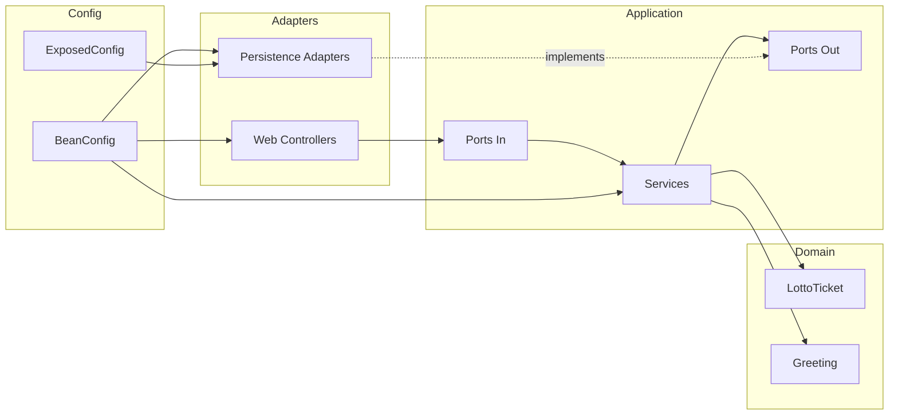
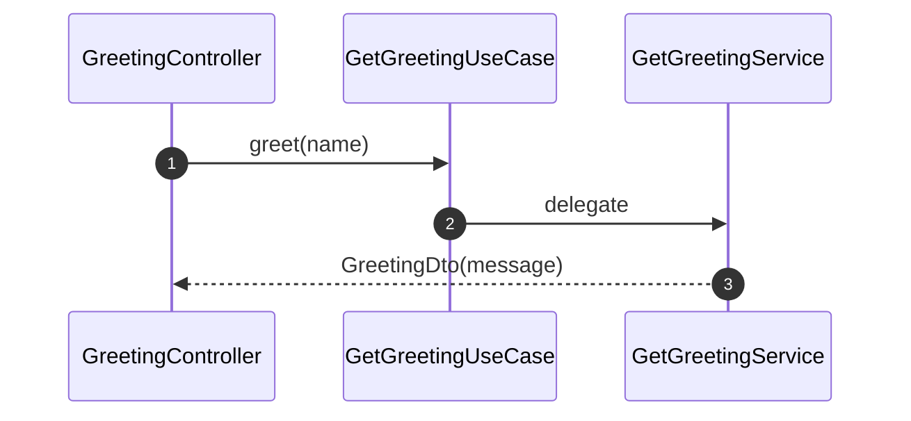
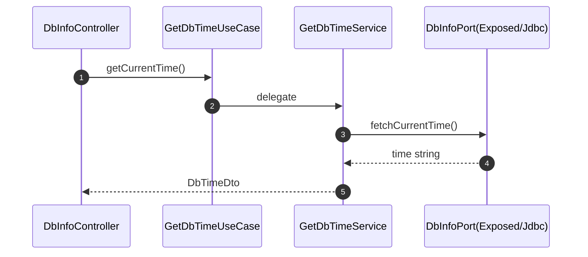
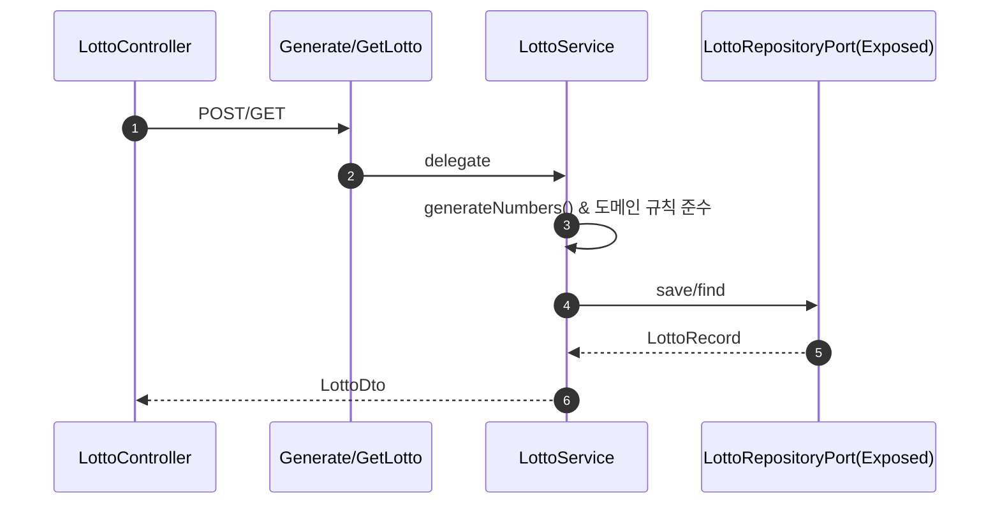

# REST Server v2 — 아키텍처 문서 (Kotlin + TDD + DDD + Clean Architecture)

이 문서는 프로젝트의 전체 구조와 설계 원칙, 각 레이어/컴포넌트의 책임, 실행 프로필 및 동작 흐름을 정리합니다.

## 목표와 원칙
- Kotlin-스러운 코드: 불변/데이터 클래스, 순수 함수 위주, 명확한 가시성/의존.
- TDD: 애플리케이션 서비스와 웹 어댑터에 대한 테스트 우선(단위/슬라이스 테스트).
- DDD: 도메인 모델(LottoTicket)에서 핵심 규칙을 명시적으로 캡슐화.
- Clean Architecture: 의존성은 바깥→안쪽 금지, 안쪽→바깥쪽 허용. 프레임워크/인프라에 독립적.

## 전체 구조
```
src/main/kotlin/yousang/rest_server
├─ domain
│  └─ model
│     ├─ Greeting.kt
│     └─ LottoTicket.kt
├─ application
│  ├─ ports
│  │  ├─ in
│  │  │  ├─ GetGreetingUseCase.kt
│  │  │  ├─ GetDbTimeUseCase.kt
│  │  │  └─ GenerateLottoUseCase.kt  (GetLottoUseCase, LottoDto 포함)
│  │  └─ out
│  │     ├─ DbInfoPort.kt
│  │     └─ LottoRepositoryPort.kt
│  └─ service
│     ├─ GetGreetingService.kt
│     ├─ GetDbTimeService.kt
│     └─ LottoService.kt
├─ adapter
│  ├─ in
│  │  └─ web
│  │     ├─ GreetingController.kt
│  │     ├─ DbInfoController.kt      (@Profile("postgres"))
│  │     └─ LottoController.kt       (@Profile("postgres"))
│  └─ out
│     └─ persistence
│        ├─ exposed
│        │  ├─ ExposedDbInfoAdapter.kt (@Profile("postgres"))
│        │  └─ ExposedLottoRepositoryAdapter.kt (@Profile("postgres"))
│        └─ jdbc
│           └─ JdbcDbInfoAdapter.kt   (@Profile("jdbc-postgres"))
└─ config
   ├─ BeanConfig.kt
   └─ ExposedConfig.kt                (@Profile("postgres"))
```

### 의존성 규칙
- domain ← application ← adapters/config (단방향)
- application은 어떤 프레임워크에도 의존하지 않음.
- adapters는 application의 포트(interfaces)에 의존하여 바인딩.



## 레이어별 책임
- Domain
  - LottoTicket: 도메인 규칙(1..45 범위, 6개, 중복 없음) 강제. 정렬 헬퍼 제공.
  - Greeting: 간단한 값 객체 성격.
- Application (Use Cases)
  - Ports In: 컨트롤러가 의존하는 유스케이스 인터페이스(GetGreetingUseCase, GetDbTimeUseCase, Generate/GetLottoUseCase)
  - Services: 순수 Kotlin 구현(GetGreetingService, GetDbTimeService, LottoService)
  - Ports Out: 외부 시스템/스토리지 의존성에 대한 추상화(DbInfoPort, LottoRepositoryPort)
- Adapters
  - Inbound(Web): Spring MVC 컨트롤러가 Ports In에 의존해 요청을 처리
  - Outbound(Persistence): Exposed/JDBC로 Ports Out을 구현
- Config
  - BeanConfig: 애플리케이션 서비스 및 포트 바인딩 구성
  - ExposedConfig: DataSource로 Exposed Database 초기화

## 실행 프로필과 빈 활성화
- 기본(프로필 미지정): Greeting만 활성화
  - GreetingController, GetGreetingUseCase(=GetGreetingService)
- postgres 프로필: DB 기반 기능 활성화
  - DbInfoController, LottoController
  - GetDbTimeUseCase, GenerateLottoUseCase, GetLottoUseCase
  - ExposedDbInfoAdapter, ExposedLottoRepositoryAdapter, ExposedConfig(Database bean)
- jdbc-postgres 프로필: 대안 JDBC 어댑터(JdbcDbInfoAdapter) 제공
  - 주의: 현재 BeanConfig에서 GetDbTimeUseCase는 "postgres" 프로필에만 바인딩되어
    jdbc-postgres 단독으로는 동작하지 않습니다. 필요 시 두 프로필을 함께 활성화하거나 BeanConfig를 조정하세요.







## 도메인 모델
- LottoTicket
  - 생성 시 다음 불변조건을 검증: 크기=6, 모두 고유, 1..45 범위
  - numbers는 불변 List<Int>, sortedNumbers() 제공

## 영속성 전략
- ExposedLottoRepositoryAdapter
  - 테이블: lotto_tickets(id BIGINT PK, numbers VARCHAR)
  - numbers는 "1,2,3,4,5,6" 형태 문자열로 저장/로딩 시 분리
  - SchemaUtils.createMissingTablesAndColumns로 필요 시 테이블 생성
- ExposedDbInfoAdapter/JdbcDbInfoAdapter
  - 현재 DB 시간 문자열을 포맷하여 반환

## API 개요
- GET /api/v1/greetings?name=Junie
  - 응답: { "message": "Hello, Junie!" }
- (postgres 프로필)
  - GET /api/v1/db/time
    - 응답: { "time": "YYYY-MM-DDTHH:mm:ss.SSSSSS+09:00" }
  - POST /api/v1/lotto
    - 응답: { "id": 1, "numbers": [1,2,3,4,5,6] }
  - GET /api/v1/lotto/{id}
  - GET /api/v1/lotto

## 테스트 전략(TDD)
- 단위 테스트
  - GetGreetingServiceTest, GetDbTimeServiceTest, LottoServiceTest
  - 외부 의존성은 Fake/Mock으로 대체하여 유스케이스 로직 검증
- 웹 슬라이스 테스트
  - GreetingControllerTest(@WebMvcTest)로 컨트롤러와 시리얼라이제이션 경계 검증

## 실행 방법
- 테스트 실행: ./gradlew test
- 기본 프로필로 애플리케이션 실행(인메모리 기능만):
  - ./gradlew bootRun
- Postgres 연동 기능 실행:
  - Postgres DataSource 설정(src/main/resources/application-postgres.properties 참고)
  - ./gradlew bootRun --args='--spring.profiles.active=postgres'
  - 또는 jdbc 어댑터를 사용하려면(현재 BeanConfig 조정 필요할 수 있음):
    - ./gradlew bootRun --args='--spring.profiles.active=postgres,jdbc-postgres'

## 변경 용이성
- 새로운 영속성(예: JPA) 도입 시 LottoRepositoryPort, DbInfoPort 구현만 추가
- 새로운 입출력 채널(예: gRPC) 도입 시 어댑터 추가 후 기존 유스케이스 재사용

## 의사결정 요약
- Clean Architecture 채택으로 테스트 용이성과 프레임워크 독립성 극대화
- 도메인 불변조건을 엔티티 내부에서 강제(실패는 빠르게), 서비스는 정책 조합에 집중
- 런타임 프로필로 인프라 선택(Exposed 기본, JDBC 대안)