# Kubernetes 배포 가이드 (AWS EKS)

엔터프라이즈급 REST Server를 AWS EKS에 멀티 포드로 배포하는 완벽한 가이드입니다.

---

## 🎯 아키텍처 개요

### 전체 시스템 아키텍처

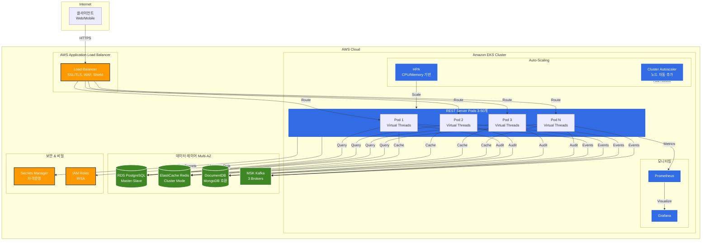
```mermaid
graph TB
    subgraph Internet
        Client[클라이언트<br/>Web/Mobile]
    end

    subgraph AWS Cloud
        subgraph ALB[AWS Application Load Balancer]
            LB[Load Balancer<br/>SSL/TLS, WAF, Shield]
        end

        subgraph EKS[Amazon EKS Cluster]
            subgraph Pods[REST Server Pods 3-50개]
                Pod1[Pod 1<br/>Virtual Threads]
                Pod2[Pod 2<br/>Virtual Threads]
                Pod3[Pod 3<br/>Virtual Threads]
                PodN[Pod N<br/>Virtual Threads]
            end

            subgraph AutoScaling[Auto-Scaling]
                HPA[HPA<br/>CPU/Memory 기반]
                CA[Cluster Autoscaler<br/>노드 자동 추가]
            end

            subgraph Monitoring[모니터링]
                Prom[Prometheus]
                Graf[Grafana]
            end
        end

        subgraph DataLayer[데이터 레이어 Multi-AZ]
            RDS[(RDS PostgreSQL<br/>Master-Slave)]
            Redis[(ElastiCache Redis<br/>Cluster Mode)]
            Mongo[(DocumentDB<br/>MongoDB 호환)]
            Kafka[MSK Kafka<br/>3 Brokers]
        end

        subgraph Security[보안 & 비밀]
            SM[Secrets Manager<br/>자격증명]
            IAM[IAM Roles<br/>IRSA]
        end
    end

    Client -->|HTTPS| LB
    LB -->|Route| Pod1
    LB -->|Route| Pod2
    LB -->|Route| Pod3
    LB -->|Route| PodN

    Pod1 & Pod2 & Pod3 & PodN -->|Query| RDS
    Pod1 & Pod2 & Pod3 & PodN -->|Cache| Redis
    Pod1 & Pod2 & Pod3 & PodN -->|Audit| Mongo
    Pod1 & Pod2 & Pod3 & PodN -->|Events| Kafka

    HPA -->|Scale| Pods
    CA -->|Add Nodes| EKS
    Pods -->|Metrics| Prom
    Prom -->|Visualize| Graf
    Pods -->|Get Secrets| SM
    Pods -->|Assume Role| IAM

    classDef awsService fill:#FF9900,stroke:#232F3E,stroke-width:2px,color:#fff
    classDef k8sService fill:#326CE5,stroke:#fff,stroke-width:2px,color:#fff
    classDef dataService fill:#3F8624,stroke:#fff,stroke-width:2px,color:#fff

    class LB,RDS,Redis,Mongo,Kafka,SM,IAM awsService
    class Pods,HPA,CA,Prom,Graf k8sService
    class RDS,Redis,Mongo,Kafka dataService
```

### 고가용성 & 확장성 전략

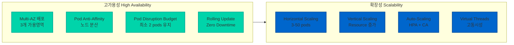
```mermaid
graph LR
    subgraph HA[고가용성 High Availability]
        direction TB
        MA[Multi-AZ 배포<br/>3개 가용영역]
        PA[Pod Anti-Affinity<br/>노드 분산]
        PDB[Pod Disruption Budget<br/>최소 2 pods 유지]
        RU[Rolling Update<br/>Zero Downtime]
    end

    subgraph Scale[확장성 Scalability]
        direction TB
        HS[Horizontal Scaling<br/>3-50 pods]
        VS[Vertical Scaling<br/>Resource 증가]
        AS[Auto-Scaling<br/>HPA + CA]
        VT[Virtual Threads<br/>고동시성]
    end

    HA --> Scale

    classDef haStyle fill:#00D4AA,stroke:#00A896,stroke-width:2px
    classDef scaleStyle fill:#0066CC,stroke:#004C99,stroke-width:2px

    class MA,PA,PDB,RU haStyle
    class HS,VS,AS,VT scaleStyle
```

---

## 📊 배포 플로우

### CI/CD 파이프라인

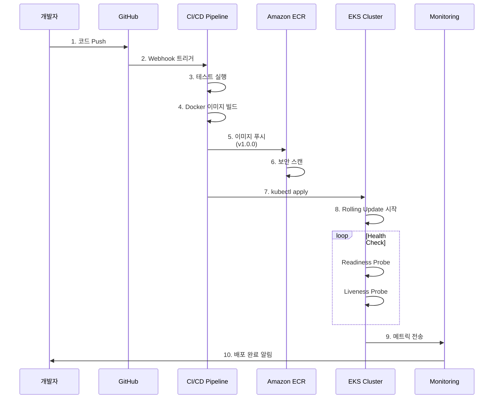
```mermaid
sequenceDiagram
    participant Dev as 개발자
    participant Git as GitHub
    participant CI as CI/CD Pipeline
    participant ECR as Amazon ECR
    participant K8s as EKS Cluster
    participant Monitor as Monitoring

    Dev->>Git: 1. 코드 Push
    Git->>CI: 2. Webhook 트리거

    CI->>CI: 3. 테스트 실행
    CI->>CI: 4. Docker 이미지 빌드

    CI->>ECR: 5. 이미지 푸시<br/>(v1.0.0)
    ECR->>ECR: 6. 보안 스캔

    CI->>K8s: 7. kubectl apply
    K8s->>K8s: 8. Rolling Update 시작

    loop Health Check
        K8s->>K8s: Readiness Probe
        K8s->>K8s: Liveness Probe
    end

    K8s->>Monitor: 9. 메트릭 전송
    Monitor->>Dev: 10. 배포 완료 알림
```

### 수동 배포 프로세스

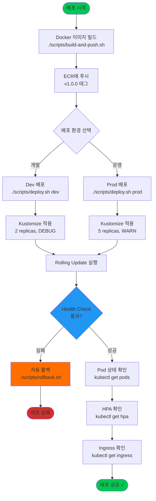
```mermaid
flowchart TD
    Start([배포 시작]) --> BuildImage[Docker 이미지 빌드<br/>./scripts/build-and-push.sh]
    BuildImage --> PushECR[ECR에 푸시<br/>v1.0.0 태그]
    PushECR --> SelectEnv{배포 환경 선택}

    SelectEnv -->|개발| DeployDev[Dev 배포<br/>./scripts/deploy.sh dev]
    SelectEnv -->|운영| DeployProd[Prod 배포<br/>./scripts/deploy.sh prod]

    DeployDev --> ApplyKustomize[Kustomize 적용<br/>2 replicas, DEBUG]
    DeployProd --> ApplyKustomize2[Kustomize 적용<br/>5 replicas, WARN]

    ApplyKustomize & ApplyKustomize2 --> RollingUpdate[Rolling Update 실행]

    RollingUpdate --> HealthCheck{Health Check<br/>통과?}
    HealthCheck -->|실패| Rollback[자동 롤백<br/>./scripts/rollback.sh]
    HealthCheck -->|성공| VerifyPods[Pod 상태 확인<br/>kubectl get pods]

    Rollback --> End([배포 실패])
    VerifyPods --> CheckHPA[HPA 확인<br/>kubectl get hpa]
    CheckHPA --> CheckIngress[Ingress 확인<br/>kubectl get ingress]
    CheckIngress --> Success([배포 성공 ✓])

    style Start fill:#00C853
    style Success fill:#00C853
    style End fill:#D32F2F
    style Rollback fill:#FF6F00
    style HealthCheck fill:#2196F3
```

---

## 🚀 Auto-Scaling 동작 방식

### Horizontal Pod Autoscaler (HPA)

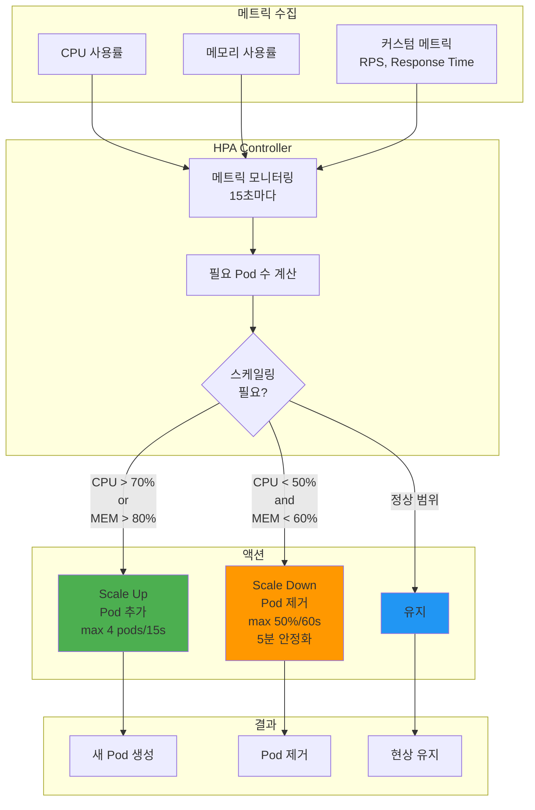
```mermaid
graph TD
    subgraph Metrics[메트릭 수집]
        CPU[CPU 사용률]
        MEM[메모리 사용률]
        Custom[커스텀 메트릭<br/>RPS, Response Time]
    end

    subgraph HPA[HPA Controller]
        Monitor[메트릭 모니터링<br/>15초마다]
        Calculate[필요 Pod 수 계산]
        Decision{스케일링<br/>필요?}
    end

    subgraph Actions[액션]
        ScaleUp[Scale Up<br/>Pod 추가<br/>max 4 pods/15s]
        ScaleDown[Scale Down<br/>Pod 제거<br/>max 50%/60s<br/>5분 안정화]
        NoAction[유지]
    end

    subgraph Result[결과]
        NewPods[새 Pod 생성]
        RemovePods[Pod 제거]
        Stable[현상 유지]
    end

    CPU & MEM & Custom --> Monitor
    Monitor --> Calculate
    Calculate --> Decision

    Decision -->|CPU > 70%<br/>or<br/>MEM > 80%| ScaleUp
    Decision -->|CPU < 50%<br/>and<br/>MEM < 60%| ScaleDown
    Decision -->|정상 범위| NoAction

    ScaleUp --> NewPods
    ScaleDown --> RemovePods
    NoAction --> Stable

    style ScaleUp fill:#4CAF50
    style ScaleDown fill:#FF9800
    style NoAction fill:#2196F3
```

### Cluster Autoscaler 연계

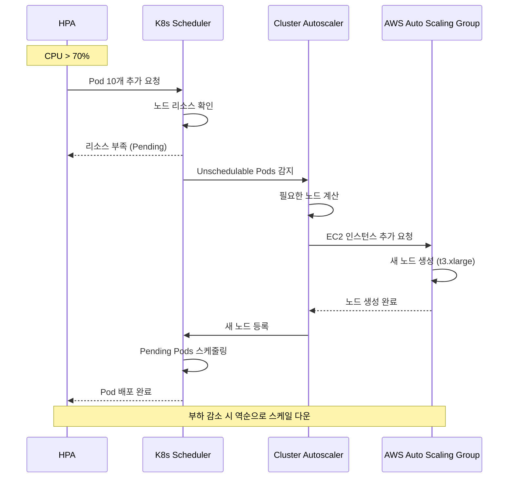
```mermaid
sequenceDiagram
    participant HPA as HPA
    participant Scheduler as K8s Scheduler
    participant CA as Cluster Autoscaler
    participant AWS as AWS Auto Scaling Group

    Note over HPA: CPU > 70%
    HPA->>Scheduler: Pod 10개 추가 요청

    Scheduler->>Scheduler: 노드 리소스 확인
    Scheduler-->>HPA: 리소스 부족 (Pending)

    Scheduler->>CA: Unschedulable Pods 감지
    CA->>CA: 필요한 노드 계산
    CA->>AWS: EC2 인스턴스 추가 요청

    AWS->>AWS: 새 노드 생성 (t3.xlarge)
    AWS-->>CA: 노드 생성 완료

    CA->>Scheduler: 새 노드 등록
    Scheduler->>Scheduler: Pending Pods 스케줄링
    Scheduler-->>HPA: Pod 배포 완료

    Note over HPA,AWS: 부하 감소 시 역순으로 스케일 다운
```

---

## 🔐 보안 아키텍처

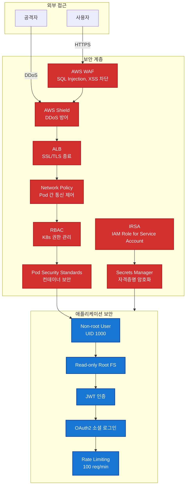
```mermaid
graph TB
    subgraph External[외부 접근]
        User[사용자]
        Attack[공격자]
    end

    subgraph SecurityLayers[보안 계층]
        WAF[AWS WAF<br/>SQL Injection, XSS 차단]
        Shield[AWS Shield<br/>DDoS 방어]
        ALB[ALB<br/>SSL/TLS 종료]

        NP[Network Policy<br/>Pod 간 통신 제어]
        RBAC[RBAC<br/>K8s 권한 관리]
        PSS[Pod Security Standards<br/>컨테이너 보안]

        IRSA[IRSA<br/>IAM Role for Service Account]
        SM[Secrets Manager<br/>자격증명 암호화]
    end

    subgraph AppSecurity[애플리케이션 보안]
        NonRoot[Non-root User<br/>UID 1000]
        ReadOnly[Read-only Root FS]
        JWT[JWT 인증]
        OAuth[OAuth2 소셜 로그인]
        RateLimit[Rate Limiting<br/>100 req/min]
    end

    User -->|HTTPS| WAF
    Attack -->|DDoS| Shield

    WAF --> Shield
    Shield --> ALB
    ALB --> NP
    NP --> RBAC
    RBAC --> PSS

    PSS --> NonRoot
    NonRoot --> ReadOnly
    ReadOnly --> JWT
    JWT --> OAuth
    OAuth --> RateLimit

    IRSA --> SM
    SM --> AppSecurity

    classDef security fill:#D32F2F,stroke:#B71C1C,stroke-width:2px,color:#fff
    classDef app fill:#1976D2,stroke:#0D47A1,stroke-width:2px,color:#fff

    class WAF,Shield,ALB,NP,RBAC,PSS,IRSA,SM security
    class NonRoot,ReadOnly,JWT,OAuth,RateLimit app
```

---

## 📡 네트워크 플로우

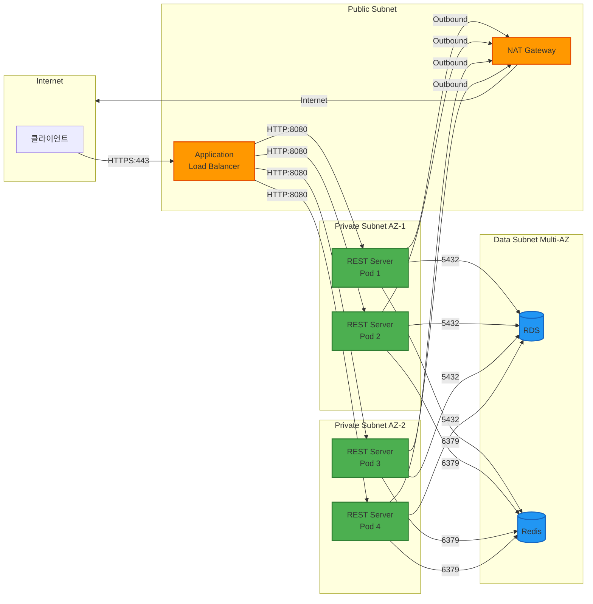
```mermaid
graph LR
    subgraph Internet
        Client[클라이언트]
    end

    subgraph PublicSubnet[Public Subnet]
        ALB[Application<br/>Load Balancer]
        NAT[NAT Gateway]
    end

    subgraph PrivateSubnet1[Private Subnet AZ-1]
        Pod1[REST Server<br/>Pod 1]
        Pod2[REST Server<br/>Pod 2]
    end

    subgraph PrivateSubnet2[Private Subnet AZ-2]
        Pod3[REST Server<br/>Pod 3]
        Pod4[REST Server<br/>Pod 4]
    end

    subgraph DataSubnet[Data Subnet Multi-AZ]
        RDS[(RDS)]
        Redis[(Redis)]
    end

    Client -->|HTTPS:443| ALB
    ALB -->|HTTP:8080| Pod1
    ALB -->|HTTP:8080| Pod2
    ALB -->|HTTP:8080| Pod3
    ALB -->|HTTP:8080| Pod4

    Pod1 & Pod2 -->|5432| RDS
    Pod3 & Pod4 -->|5432| RDS
    Pod1 & Pod2 -->|6379| Redis
    Pod3 & Pod4 -->|6379| Redis

    Pod1 & Pod2 & Pod3 & Pod4 -->|Outbound| NAT
    NAT -->|Internet| Internet

    classDef public fill:#FF9800,stroke:#E65100,stroke-width:2px
    classDef private fill:#4CAF50,stroke:#2E7D32,stroke-width:2px
    classDef data fill:#2196F3,stroke:#1565C0,stroke-width:2px

    class ALB,NAT public
    class Pod1,Pod2,Pod3,Pod4 private
    class RDS,Redis data
```

---

## 📈 모니터링 아키텍처

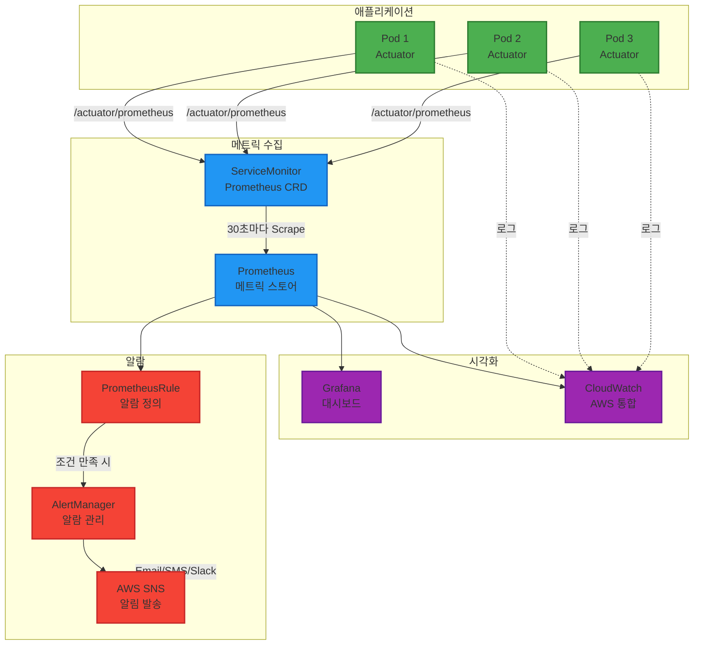
```mermaid
graph TB
    subgraph Apps[애플리케이션]
        Pod1[Pod 1<br/>Actuator]
        Pod2[Pod 2<br/>Actuator]
        Pod3[Pod 3<br/>Actuator]
    end

    subgraph Collection[메트릭 수집]
        SM[ServiceMonitor<br/>Prometheus CRD]
        Prom[Prometheus<br/>메트릭 스토어]
    end

    subgraph Visualization[시각화]
        Graf[Grafana<br/>대시보드]
        CW[CloudWatch<br/>AWS 통합]
    end

    subgraph Alerting[알람]
        PR[PrometheusRule<br/>알람 정의]
        AM[AlertManager<br/>알람 관리]
        SNS[AWS SNS<br/>알림 발송]
    end

    Pod1 & Pod2 & Pod3 -->|/actuator/prometheus| SM
    SM -->|30초마다 Scrape| Prom

    Prom --> Graf
    Prom --> CW
    Prom --> PR

    PR -->|조건 만족 시| AM
    AM --> SNS
    SNS -->|Email/SMS/Slack| Alerting

    Pod1 & Pod2 & Pod3 -.->|로그| CW

    classDef app fill:#4CAF50,stroke:#2E7D32,stroke-width:2px
    classDef metric fill:#2196F3,stroke:#1565C0,stroke-width:2px
    classDef viz fill:#9C27B0,stroke:#6A1B9A,stroke-width:2px
    classDef alert fill:#F44336,stroke:#C62828,stroke-width:2px

    class Pod1,Pod2,Pod3 app
    class SM,Prom metric
    class Graf,CW viz
    class PR,AM,SNS alert
```

### 주요 메트릭 및 알람

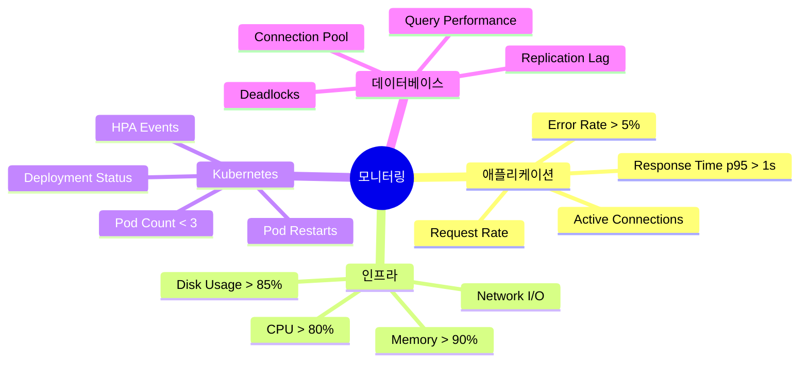
```mermaid
mindmap
  root((모니터링))
    애플리케이션
      Error Rate > 5%
      Response Time p95 > 1s
      Request Rate
      Active Connections
    인프라
      CPU > 80%
      Memory > 90%
      Disk Usage > 85%
      Network I/O
    Kubernetes
      Pod Restarts
      Pod Count < 3
      Deployment Status
      HPA Events
    데이터베이스
      Connection Pool
      Query Performance
      Replication Lag
      Deadlocks
```

---

## 🔄 Disaster Recovery 전략

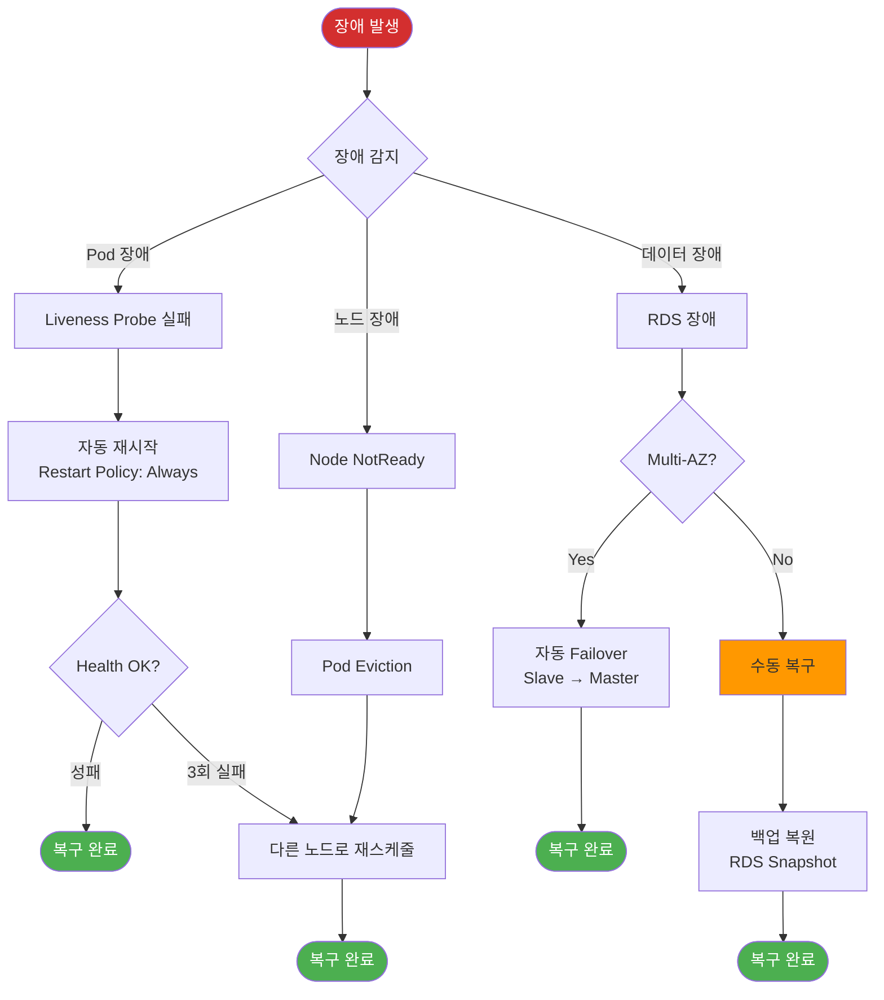
```mermaid
flowchart TD
    Start([장애 발생]) --> Detect{장애 감지}

    Detect -->|Pod 장애| PodFailure[Liveness Probe 실패]
    Detect -->|노드 장애| NodeFailure[Node NotReady]
    Detect -->|데이터 장애| DataFailure[RDS 장애]

    PodFailure --> AutoRestart[자동 재시작<br/>Restart Policy: Always]
    AutoRestart --> HealthCheck1{Health OK?}
    HealthCheck1 -->|성패| Recovered1([복구 완료])
    HealthCheck1 -->|3회 실패| ReschedulePod[다른 노드로 재스케줄]

    NodeFailure --> EvictPods[Pod Eviction]
    EvictPods --> ReschedulePod
    ReschedulePod --> Recovered2([복구 완료])

    DataFailure --> MultiAZ{Multi-AZ?}
    MultiAZ -->|Yes| Failover[자동 Failover<br/>Slave → Master]
    MultiAZ -->|No| Manual[수동 복구]
    Failover --> Recovered3([복구 완료])

    Manual --> Backup[백업 복원<br/>RDS Snapshot]
    Backup --> Recovered4([복구 완료])

    style Start fill:#D32F2F,color:#fff
    style Recovered1 fill:#4CAF50,color:#fff
    style Recovered2 fill:#4CAF50,color:#fff
    style Recovered3 fill:#4CAF50,color:#fff
    style Recovered4 fill:#4CAF50,color:#fff
    style Manual fill:#FF9800
```

---

## 📦 리소스 계층 구조

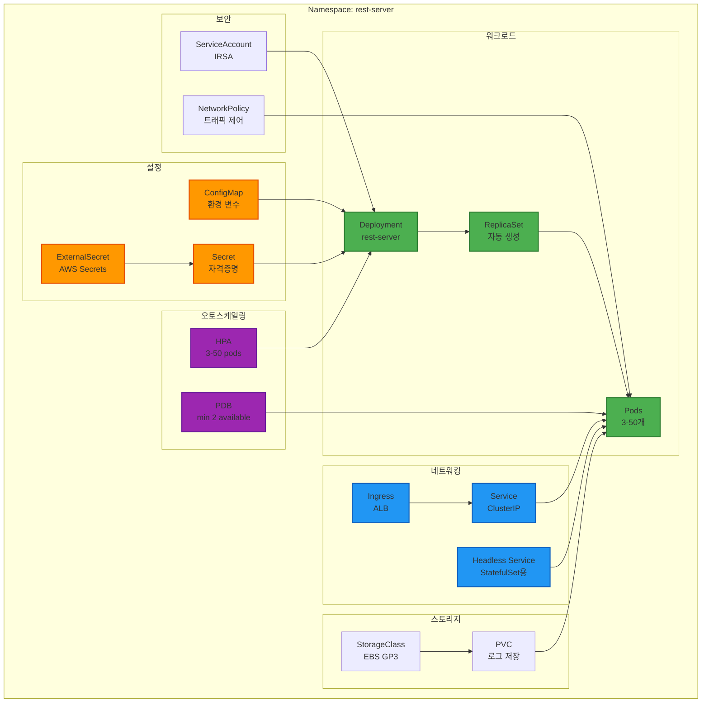
```mermaid
graph TD
    subgraph Namespace[Namespace: rest-server]
        subgraph Workloads[워크로드]
            Deploy[Deployment<br/>rest-server]
            RS[ReplicaSet<br/>자동 생성]
            Pods[Pods<br/>3-50개]
        end

        subgraph Networking[네트워킹]
            SVC[Service<br/>ClusterIP]
            Headless[Headless Service<br/>StatefulSet용]
            Ingress[Ingress<br/>ALB]
        end

        subgraph Config[설정]
            CM[ConfigMap<br/>환경 변수]
            Secret[Secret<br/>자격증명]
            ES[ExternalSecret<br/>AWS Secrets]
        end

        subgraph AutoScale[오토스케일링]
            HPA[HPA<br/>3-50 pods]
            PDB[PDB<br/>min 2 available]
        end

        subgraph Storage[스토리지]
            SC[StorageClass<br/>EBS GP3]
            PVC[PVC<br/>로그 저장]
        end

        subgraph Security[보안]
            SA[ServiceAccount<br/>IRSA]
            NP[NetworkPolicy<br/>트래픽 제어]
        end
    end

    Deploy --> RS
    RS --> Pods
    SVC --> Pods
    Headless --> Pods
    Ingress --> SVC

    CM --> Deploy
    Secret --> Deploy
    ES --> Secret

    HPA --> Deploy
    PDB --> Pods

    PVC --> Pods
    SC --> PVC

    SA --> Deploy
    NP --> Pods

    classDef workload fill:#4CAF50,stroke:#2E7D32,stroke-width:2px
    classDef network fill:#2196F3,stroke:#1565C0,stroke-width:2px
    classDef config fill:#FF9800,stroke:#E65100,stroke-width:2px
    classDef scale fill:#9C27B0,stroke:#6A1B9A,stroke-width:2px

    class Deploy,RS,Pods workload
    class SVC,Headless,Ingress network
    class CM,Secret,ES config
    class HPA,PDB scale
```

---

## 📋 사전 준비

### 1. 필수 도구 설치

```bash
# AWS CLI
curl "https://awscli.amazonaws.com/awscli-exe-linux-x86_64.zip" -o "awscliv2.zip"
unzip awscliv2.zip
sudo ./aws/install

# kubectl
curl -LO "https://dl.k8s.io/release/$(curl -L -s https://dl.k8s.io/release/stable.txt)/bin/linux/amd64/kubectl"
sudo install -o root -g root -m 0755 kubectl /usr/local/bin/kubectl

# eksctl
curl --silent --location "https://github.com/weaveworks/eksctl/releases/latest/download/eksctl_$(uname -s)_amd64.tar.gz" | tar xz -C /tmp
sudo mv /tmp/eksctl /usr/local/bin

# Helm
curl https://raw.githubusercontent.com/helm/helm/main/scripts/get-helm-3 | bash

# kustomize
curl -s "https://raw.githubusercontent.com/kubernetes-sigs/kustomize/master/hack/install_kustomize.sh"  | bash
sudo mv kustomize /usr/local/bin/
```

### 2. AWS 인증 설정

```bash
aws configure
# AWS Access Key ID:
# AWS Secret Access Key:
# Default region name: ap-northeast-2
# Default output format: json
```

---

## 🚀 1단계: EKS 클러스터 생성

### 클러스터 생성 옵션

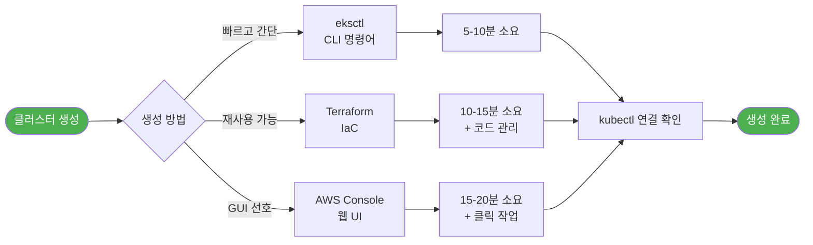
```mermaid
graph LR
    Start([클러스터 생성]) --> Choice{생성 방법}

    Choice -->|빠르고 간단| eksctl[eksctl<br/>CLI 명령어]
    Choice -->|재사용 가능| Terraform[Terraform<br/>IaC]
    Choice -->|GUI 선호| Console[AWS Console<br/>웹 UI]

    eksctl --> Create1[5-10분 소요]
    Terraform --> Create2[10-15분 소요<br/>+ 코드 관리]
    Console --> Create3[15-20분 소요<br/>+ 클릭 작업]

    Create1 & Create2 & Create3 --> Verify[kubectl 연결 확인]
    Verify --> Done([생성 완료])

    style Start fill:#4CAF50,color:#fff
    style Done fill:#4CAF50,color:#fff
```

### Option 1: eksctl 사용 (권장 - 빠름)

```bash
eksctl create cluster \
  --name rest-server-cluster \
  --region ap-northeast-2 \
  --version 1.28 \
  --nodegroup-name general-purpose \
  --node-type t3.xlarge \
  --nodes 3 \
  --nodes-min 3 \
  --nodes-max 10 \
  --managed \
  --with-oidc \
  --ssh-access \
  --ssh-public-key your-key-name
```

### kubeconfig 설정

```bash
aws eks update-kubeconfig \
  --region ap-northeast-2 \
  --name rest-server-cluster

kubectl get nodes
```

---

## 🔧 2단계: 필수 Add-ons 설치

### Add-ons 설치 순서

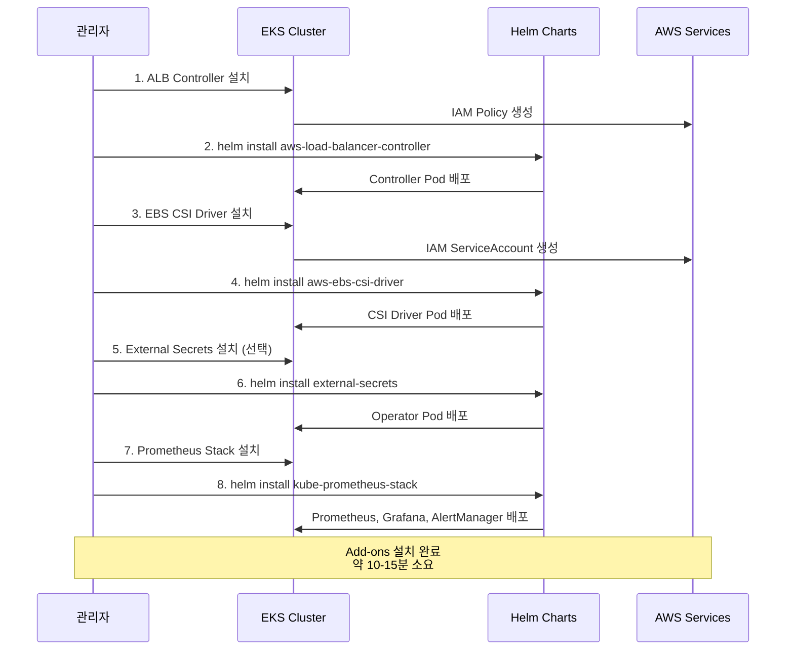
```mermaid
sequenceDiagram
    participant Admin as 관리자
    participant EKS as EKS Cluster
    participant Helm as Helm Charts
    participant AWS as AWS Services

    Admin->>EKS: 1. ALB Controller 설치
    EKS->>AWS: IAM Policy 생성
    Admin->>Helm: 2. helm install aws-load-balancer-controller
    Helm->>EKS: Controller Pod 배포

    Admin->>EKS: 3. EBS CSI Driver 설치
    EKS->>AWS: IAM ServiceAccount 생성
    Admin->>Helm: 4. helm install aws-ebs-csi-driver
    Helm->>EKS: CSI Driver Pod 배포

    Admin->>EKS: 5. External Secrets 설치 (선택)
    Admin->>Helm: 6. helm install external-secrets
    Helm->>EKS: Operator Pod 배포

    Admin->>EKS: 7. Prometheus Stack 설치
    Admin->>Helm: 8. helm install kube-prometheus-stack
    Helm->>EKS: Prometheus, Grafana, AlertManager 배포

    Note over Admin,AWS: Add-ons 설치 완료<br/>약 10-15분 소요
```

### 1. AWS Load Balancer Controller

```bash
# IAM Policy 생성
curl -o iam_policy.json https://raw.githubusercontent.com/kubernetes-sigs/aws-load-balancer-controller/main/docs/install/iam_policy.json

aws iam create-policy \
  --policy-name AWSLoadBalancerControllerIAMPolicy \
  --policy-document file://iam_policy.json

# Helm으로 설치
helm repo add eks https://aws.github.io/eks-charts
helm repo update

helm install aws-load-balancer-controller eks/aws-load-balancer-controller \
  -n kube-system \
  --set clusterName=rest-server-cluster \
  --set serviceAccount.create=true \
  --set region=ap-northeast-2 \
  --set vpcId=<VPC_ID>
```

### 2. EBS CSI Driver

```bash
eksctl create iamserviceaccount \
  --name ebs-csi-controller-sa \
  --namespace kube-system \
  --cluster rest-server-cluster \
  --attach-policy-arn arn:aws:iam::aws:policy/service-role/AmazonEBSCSIDriverPolicy \
  --approve

helm repo add aws-ebs-csi-driver https://kubernetes-sigs.github.io/aws-ebs-csi-driver
helm repo update

helm install aws-ebs-csi-driver aws-ebs-csi-driver/aws-ebs-csi-driver \
  --namespace kube-system \
  --set controller.serviceAccount.create=false \
  --set controller.serviceAccount.name=ebs-csi-controller-sa
```

### 3. External Secrets Operator (선택사항)

```bash
helm repo add external-secrets https://charts.external-secrets.io
helm repo update

helm install external-secrets \
  external-secrets/external-secrets \
  -n external-secrets-system \
  --create-namespace
```

### 4. Prometheus + Grafana (모니터링)

```bash
helm repo add prometheus-community https://prometheus-community.github.io/helm-charts
helm repo update

helm install prometheus prometheus-community/kube-prometheus-stack \
  -n monitoring \
  --create-namespace \
  --set prometheus.prometheusSpec.serviceMonitorSelectorNilUsesHelmValues=false
```

---

## 📦 3단계: AWS 리소스 생성

### AWS 리소스 프로비저닝 전략

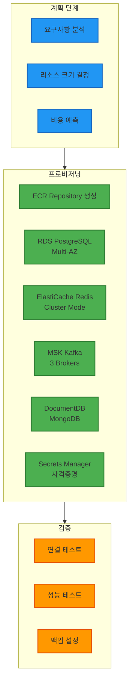
```mermaid
graph TB
    subgraph Planning[계획 단계]
        Req[요구사항 분석]
        Size[리소스 크기 결정]
        Cost[비용 예측]
    end

    subgraph Provisioning[프로비저닝]
        ECR[ECR Repository 생성]
        RDS[RDS PostgreSQL<br/>Multi-AZ]
        Redis[ElastiCache Redis<br/>Cluster Mode]
        Kafka[MSK Kafka<br/>3 Brokers]
        Mongo[DocumentDB<br/>MongoDB]
        SM[Secrets Manager<br/>자격증명]
    end

    subgraph Validation[검증]
        Conn[연결 테스트]
        Perf[성능 테스트]
        Backup[백업 설정]
    end

    Planning --> Provisioning
    Provisioning --> Validation

    classDef plan fill:#2196F3,stroke:#1565C0,stroke-width:2px
    classDef prov fill:#4CAF50,stroke:#2E7D32,stroke-width:2px
    classDef valid fill:#FF9800,stroke:#E65100,stroke-width:2px

    class Req,Size,Cost plan
    class ECR,RDS,Redis,Kafka,Mongo,SM prov
    class Conn,Perf,Backup valid
```

### 1. ECR Repository

```bash
aws ecr create-repository \
  --repository-name rest-server \
  --region ap-northeast-2

# 출력에서 repositoryUri 확인
# 123456789012.dkr.ecr.ap-northeast-2.amazonaws.com/rest-server
```

### 2. AWS Secrets Manager (자격증명 저장)

```bash
# Database credentials
aws secretsmanager create-secret \
  --name rest-server/db \
  --description "Database credentials" \
  --secret-string '{"username":"postgres","password":"your-secure-password"}' \
  --region ap-northeast-2

# OAuth2 credentials
aws secretsmanager create-secret \
  --name rest-server/oauth2 \
  --secret-string '{
    "google_client_id":"xxx",
    "google_client_secret":"xxx",
    "naver_client_id":"xxx",
    "naver_client_secret":"xxx",
    "kakao_client_id":"xxx",
    "kakao_client_secret":"xxx"
  }'

# JWT secret
aws secretsmanager create-secret \
  --name rest-server/jwt \
  --secret-string '{"secret_key":"your-256-bit-secret-key-here"}'
```

---

## 🐳 4단계: Docker 이미지 빌드 및 푸시

### 이미지 빌드 프로세스

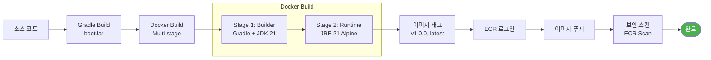
```mermaid
flowchart LR
    Source[소스 코드] --> Build[Gradle Build<br/>bootJar]
    Build --> Docker[Docker Build<br/>Multi-stage]

    subgraph DockerBuild[Docker Build]
        Stage1[Stage 1: Builder<br/>Gradle + JDK 21]
        Stage2[Stage 2: Runtime<br/>JRE 21 Alpine]
    end

    Docker --> Stage1
    Stage1 --> Stage2
    Stage2 --> Tag[이미지 태그<br/>v1.0.0, latest]
    Tag --> ECRLogin[ECR 로그인]
    ECRLogin --> Push[이미지 푸시]
    Push --> Scan[보안 스캔<br/>ECR Scan]
    Scan --> Complete([완료])

    style Complete fill:#4CAF50,color:#fff
```

### 이미지 빌드

```bash
# 환경 변수 설정
export AWS_ACCOUNT_ID=$(aws sts get-caller-identity --query Account --output text)
export AWS_REGION=ap-northeast-2
export VERSION=v1.0.0

# 빌드 스크립트 실행
./scripts/build-and-push.sh $VERSION
```

---

## ☸️ 5단계: Kubernetes 배포

### 배포 환경별 설정 차이

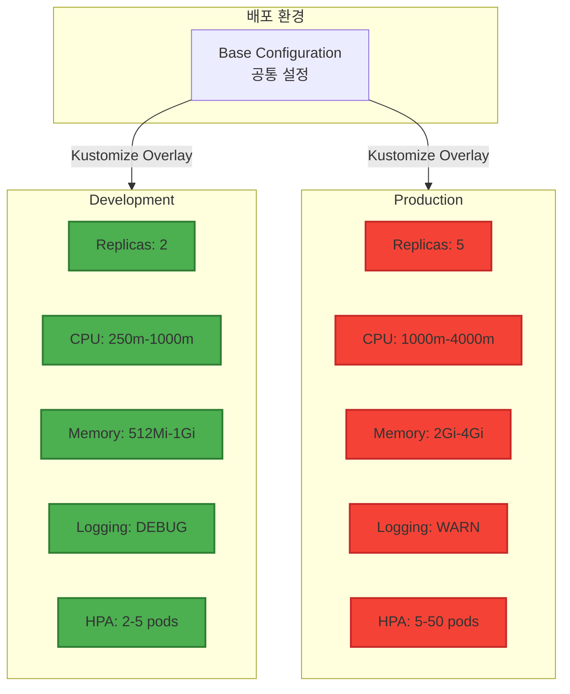
```mermaid
graph TD
    subgraph Config[배포 환경]
        Base[Base Configuration<br/>공통 설정]
    end

    subgraph Dev[Development]
        DevRep[Replicas: 2]
        DevCPU[CPU: 250m-1000m]
        DevMem[Memory: 512Mi-1Gi]
        DevLog[Logging: DEBUG]
        DevHPA[HPA: 2-5 pods]
    end

    subgraph Prod[Production]
        ProdRep[Replicas: 5]
        ProdCPU[CPU: 1000m-4000m]
        ProdMem[Memory: 2Gi-4Gi]
        ProdLog[Logging: WARN]
        ProdHPA[HPA: 5-50 pods]
    end

    Base -->|Kustomize Overlay| Dev
    Base -->|Kustomize Overlay| Prod

    classDef dev fill:#4CAF50,stroke:#2E7D32,stroke-width:2px
    classDef prod fill:#F44336,stroke:#C62828,stroke-width:2px

    class DevRep,DevCPU,DevMem,DevLog,DevHPA dev
    class ProdRep,ProdCPU,ProdMem,ProdLog,ProdHPA prod
```

### Development 환경 배포

```bash
kubectl apply -k k8s/overlays/dev

# 또는 스크립트 사용
./scripts/deploy.sh dev v1.0.0
```

### Production 환경 배포

```bash
kubectl apply -k k8s/overlays/prod

# 또는 스크립트 사용
./scripts/deploy.sh prod v1.0.0
```

### 배포 확인

```bash
# Pods 확인
kubectl get pods -n rest-server -w

# Deployment 확인
kubectl get deployment -n rest-server

# Service 확인
kubectl get svc -n rest-server

# Ingress 확인
kubectl get ingress -n rest-server

# HPA 확인
kubectl get hpa -n rest-server

# Logs 확인
kubectl logs -f deployment/rest-server -n rest-server
```

---

## 📊 6단계: 모니터링 설정

### 모니터링 대시보드 구성

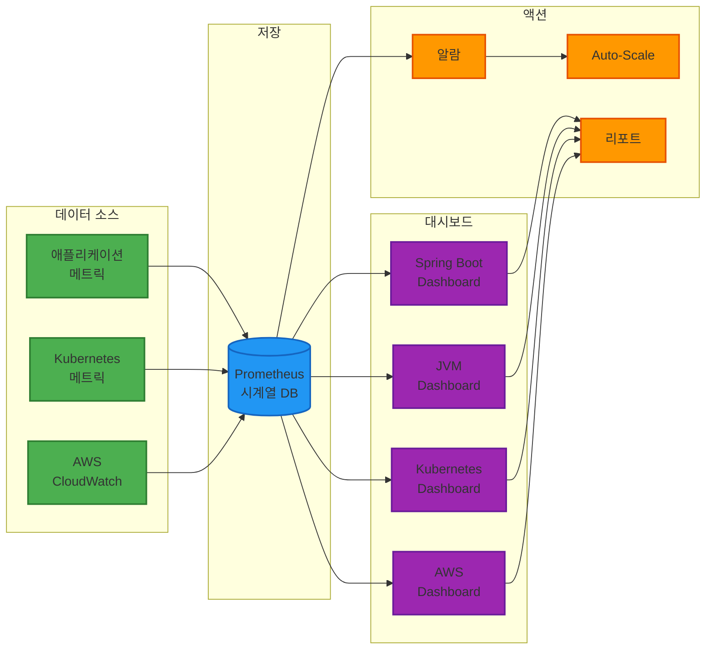
```mermaid
graph LR
    subgraph Sources[데이터 소스]
        App[애플리케이션<br/>메트릭]
        K8s[Kubernetes<br/>메트릭]
        AWS[AWS<br/>CloudWatch]
    end

    subgraph Storage[저장]
        Prom[(Prometheus<br/>시계열 DB)]
    end

    subgraph Dashboards[대시보드]
        G1[Spring Boot<br/>Dashboard]
        G2[JVM<br/>Dashboard]
        G3[Kubernetes<br/>Dashboard]
        G4[AWS<br/>Dashboard]
    end

    subgraph Actions[액션]
        Alert[알람]
        Scale[Auto-Scale]
        Report[리포트]
    end

    App & K8s & AWS --> Prom
    Prom --> G1 & G2 & G3 & G4
    Prom --> Alert
    Alert --> Scale
    G1 & G2 & G3 & G4 --> Report

    classDef source fill:#4CAF50,stroke:#2E7D32,stroke-width:2px
    classDef storage fill:#2196F3,stroke:#1565C0,stroke-width:2px
    classDef dash fill:#9C27B0,stroke:#6A1B9A,stroke-width:2px
    classDef action fill:#FF9800,stroke:#E65100,stroke-width:2px

    class App,K8s,AWS source
    class Prom storage
    class G1,G2,G3,G4 dash
    class Alert,Scale,Report action
```

### 1. ServiceMonitor 배포

```bash
kubectl apply -f k8s/monitoring/servicemonitor.yaml
```

### 2. Grafana 대시보드 접속

```bash
# Grafana 포트 포워딩
kubectl port-forward -n monitoring svc/prometheus-grafana 3000:80

# 브라우저에서 접속: http://localhost:3000
# 기본 계정: admin / prom-operator
```

### 3. 대시보드 Import

- Spring Boot 2.x Dashboard: ID `11378`
- JVM Dashboard: ID `4701`
- Kubernetes Cluster Dashboard: ID `7249`

---

## 🔄 7단계: Auto-Scaling 동작 확인

### 부하 테스트 시나리오

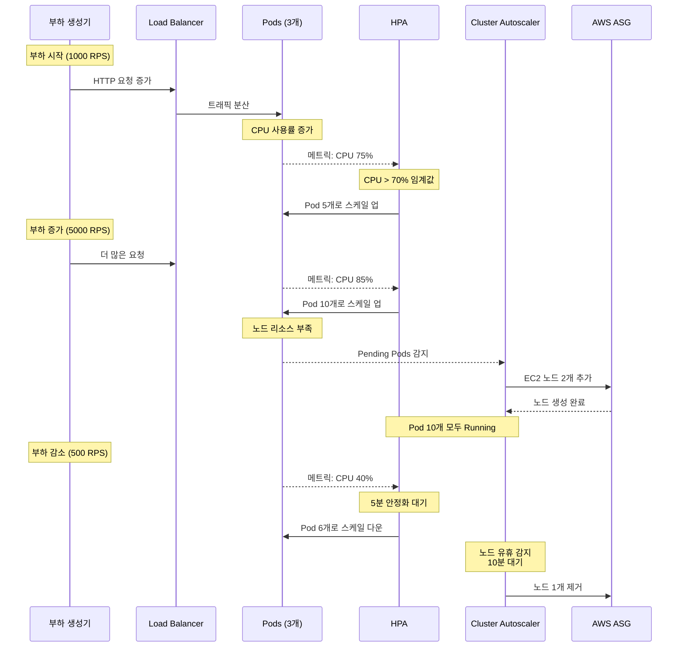
```mermaid
sequenceDiagram
    participant Tester as 부하 생성기
    participant ALB as Load Balancer
    participant Pods as Pods (3개)
    participant HPA as HPA
    participant CA as Cluster Autoscaler
    participant AWS as AWS ASG

    Note over Tester: 부하 시작 (1000 RPS)
    Tester->>ALB: HTTP 요청 증가
    ALB->>Pods: 트래픽 분산

    Note over Pods: CPU 사용률 증가
    Pods-->>HPA: 메트릭: CPU 75%

    Note over HPA: CPU > 70% 임계값
    HPA->>Pods: Pod 5개로 스케일 업

    Note over Tester: 부하 증가 (5000 RPS)
    Tester->>ALB: 더 많은 요청
    Pods-->>HPA: 메트릭: CPU 85%

    HPA->>Pods: Pod 10개로 스케일 업

    Note over Pods: 노드 리소스 부족
    Pods-->>CA: Pending Pods 감지
    CA->>AWS: EC2 노드 2개 추가
    AWS-->>CA: 노드 생성 완료

    Note over HPA,CA: Pod 10개 모두 Running

    Note over Tester: 부하 감소 (500 RPS)
    Pods-->>HPA: 메트릭: CPU 40%

    Note over HPA: 5분 안정화 대기
    HPA->>Pods: Pod 6개로 스케일 다운

    Note over CA: 노드 유휴 감지<br/>10분 대기
    CA->>AWS: 노드 1개 제거
```

### HPA 테스트

```bash
# 부하 생성 (별도 터미널)
kubectl run -i --tty load-generator --rm --image=busybox --restart=Never -- /bin/sh -c "while sleep 0.01; do wget -q -O- http://rest-server:8080/actuator/health; done"

# HPA 상태 확인
kubectl get hpa -n rest-server -w

# Pod 자동 증가 확인
kubectl get pods -n rest-server -w
```

---

## 🛠️ 운영 명령어

### 일상 운영 작업 플로우

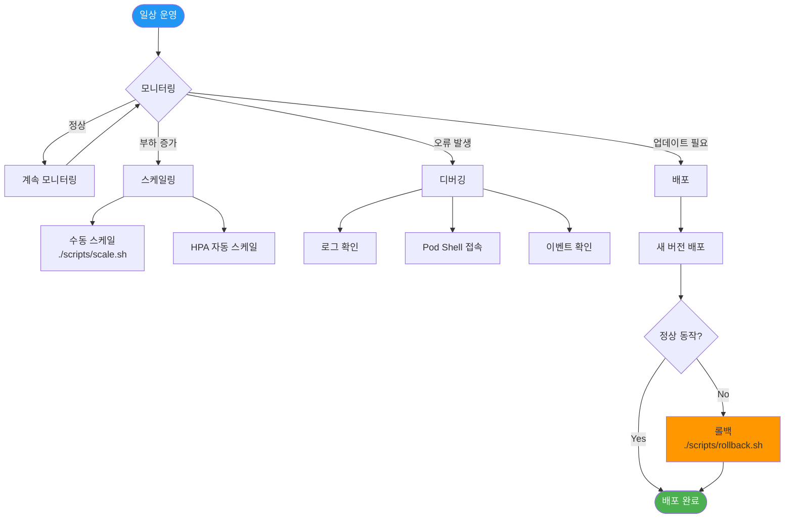
```mermaid
graph TB
    Start([일상 운영]) --> Monitor{모니터링}

    Monitor -->|정상| Continue[계속 모니터링]
    Monitor -->|부하 증가| Scale[스케일링]
    Monitor -->|오류 발생| Debug[디버깅]
    Monitor -->|업데이트 필요| Deploy[배포]

    Scale --> Manual[수동 스케일<br/>./scripts/scale.sh]
    Scale --> Auto[HPA 자동 스케일]

    Debug --> Logs[로그 확인]
    Debug --> Shell[Pod Shell 접속]
    Debug --> Events[이벤트 확인]

    Deploy --> NewVersion[새 버전 배포]
    NewVersion --> Check{정상 동작?}
    Check -->|Yes| Complete([배포 완료])
    Check -->|No| Rollback[롤백<br/>./scripts/rollback.sh]

    Rollback --> Complete
    Continue --> Monitor

    style Start fill:#2196F3,color:#fff
    style Complete fill:#4CAF50,color:#fff
    style Rollback fill:#FF9800
```

### 스케일링

```bash
# 수동 스케일링
./scripts/scale.sh prod 10  # 10개 포드로 스케일

# 또는
kubectl scale deployment rest-server --replicas=10 -n rest-server
```

### 롤백

```bash
# 이전 버전으로 롤백
./scripts/rollback.sh prod

# 특정 리비전으로 롤백
kubectl rollout undo deployment/rest-server --to-revision=3 -n rest-server

# 롤아웃 히스토리 확인
kubectl rollout history deployment/rest-server -n rest-server
```

### 로그 확인

```bash
# 실시간 로그
kubectl logs -f deployment/rest-server -n rest-server

# 최근 100줄
kubectl logs --tail=100 deployment/rest-server -n rest-server

# 특정 Pod 로그
kubectl logs -f <pod-name> -n rest-server

# 이전 컨테이너 로그 (재시작된 경우)
kubectl logs <pod-name> --previous -n rest-server
```

---

## 🚨 트러블슈팅

### 문제 해결 Decision Tree

```mermaid
graph TD
    Problem([문제 발생]) --> Type{문제 유형}

    Type -->|Pod 시작 안됨| PodIssue[Pod 이슈]
    Type -->|연결 안됨| ConnIssue[연결 이슈]
    Type -->|성능 저하| PerfIssue[성능 이슈]
    Type -->|오류 발생| ErrorIssue[오류 이슈]

    PodIssue --> CheckEvents[이벤트 확인<br/>kubectl describe pod]
    CheckEvents --> ImagePull{ImagePullBackOff?}
    ImagePull -->|Yes| FixImage[ECR 로그인 확인<br/>이미지 존재 확인]
    ImagePull -->|No| CheckProbe{Probe 실패?}
    CheckProbe -->|Yes| FixProbe[Health 엔드포인트 확인<br/>시작 시간 증가]
    CheckProbe -->|No| CheckResource{리소스 부족?}
    CheckResource -->|Yes| AddResource[노드 추가<br/>리소스 증가]

    ConnIssue --> CheckService[Service 확인<br/>kubectl get svc]
    CheckService --> CheckIngress[Ingress 확인<br/>kubectl get ing]
    CheckIngress --> CheckDNS[DNS 확인<br/>nslookup]
    CheckDNS --> CheckSG[Security Group 확인]

    PerfIssue --> CheckMetrics[메트릭 확인<br/>Grafana]
    CheckMetrics --> HighCPU{CPU 높음?}
    HighCPU -->|Yes| ScaleUp[HPA 스케일 업<br/>리소스 증가]
    HighCPU -->|No| CheckDB{DB 느림?}
    CheckDB -->|Yes| OptimizeDB[쿼리 최적화<br/>인덱스 추가]

    ErrorIssue --> CheckLogs[로그 확인<br/>kubectl logs]
    CheckLogs --> CheckError{에러 유형}
    CheckError -->|DB 연결| FixDB[DB 연결 확인<br/>자격증명 확인]
    CheckError -->|OOM| FixMemory[메모리 증가<br/>Heap 설정 조정]
    CheckError -->|타임아웃| FixTimeout[타임아웃 증가<br/>성능 최적화]

    FixImage & FixProbe & AddResource & CheckSG & ScaleUp & OptimizeDB & FixDB & FixMemory & FixTimeout --> Resolved([해결])

    style Problem fill:#D32F2F,color:#fff
    style Resolved fill:#4CAF50,color:#fff
```

### Pod가 시작하지 않을 때

```bash
# 이벤트 확인
kubectl describe pod <pod-name> -n rest-server

# 로그 확인
kubectl logs <pod-name> -n rest-server --previous

# Init Container 로그
kubectl logs <pod-name> -c wait-for-postgres -n rest-server
```

### Readiness Probe 실패

```bash
# Health 엔드포인트 직접 확인
kubectl exec -it <pod-name> -n rest-server -- curl http://localhost:8080/actuator/health

# Readiness 상세 확인
kubectl exec -it <pod-name> -n rest-server -- curl http://localhost:8080/actuator/health/readiness
```

### DB 연결 실패

```bash
# DNS 확인
kubectl exec -it <pod-name> -n rest-server -- nslookup <rds-endpoint>

# 네트워크 확인
kubectl exec -it <pod-name> -n rest-server -- nc -zv <rds-endpoint> 5432

# 자격증명 확인
kubectl get secret rest-server-secret -n rest-server -o yaml
```

---

## 📚 참고 자료

- [AWS EKS Best Practices](https://aws.github.io/aws-eks-best-practices/)
- [Kubernetes Documentation](https://kubernetes.io/docs/)
- [Spring Boot on Kubernetes](https://spring.io/guides/gs/spring-boot-kubernetes/)
- [Java 21 Virtual Threads](https://openjdk.org/jeps/444)
- [Prometheus Monitoring](https://prometheus.io/docs/)
- [Grafana Dashboards](https://grafana.com/grafana/dashboards/)

---

## 🎯 배포 체크리스트

```mermaid
graph TD
    Start([배포 준비]) --> C1{EKS 클러스터}
    C1 -->|완료| C2{Add-ons}
    C2 -->|완료| C3{AWS 리소스}
    C3 -->|완료| C4{Docker 이미지}
    C4 -->|완료| C5{K8s 배포}
    C5 -->|완료| C6{Health Check}
    C6 -->|완료| C7{모니터링}
    C7 -->|완료| C8{Auto-Scaling}
    C8 -->|완료| Complete([배포 완료 ✓])

    C1 -->|미완료| Fix1[클러스터 생성]
    C2 -->|미완료| Fix2[Add-ons 설치]
    C3 -->|미완료| Fix3[RDS/Redis/MSK 생성]
    C4 -->|미완료| Fix4[이미지 빌드 및 푸시]
    C5 -->|미완료| Fix5[kubectl apply]
    C6 -->|미완료| Fix6[Probe 설정 확인]
    C7 -->|미완료| Fix7[Prometheus 설정]
    C8 -->|미완료| Fix8[HPA 확인]

    Fix1 & Fix2 & Fix3 & Fix4 & Fix5 & Fix6 & Fix7 & Fix8 --> Start

    style Complete fill:#4CAF50,color:#fff
    style Start fill:#2196F3,color:#fff
```

- [ ] EKS 클러스터 생성
- [ ] Add-ons 설치 (ALB Controller, EBS CSI, etc.)
- [ ] AWS 리소스 생성 (RDS, ElastiCache, MSK)
- [ ] ECR에 이미지 푸시
- [ ] ConfigMap/Secret 설정
- [ ] Kubernetes 배포
- [ ] Health Check 확인
- [ ] Ingress 설정 및 도메인 연결
- [ ] SSL/TLS 인증서 설정
- [ ] HPA 동작 확인
- [ ] 모니터링 대시보드 설정
- [ ] 알람 설정
- [ ] 백업 전략 수립

---

**배포 완료!** 🎉

멀티 포드 환경에서 엔터프라이즈급 REST API가 실행 중입니다.
