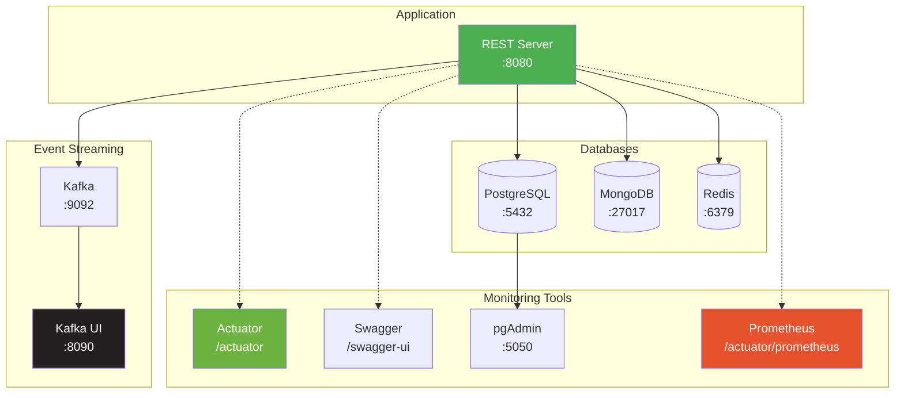
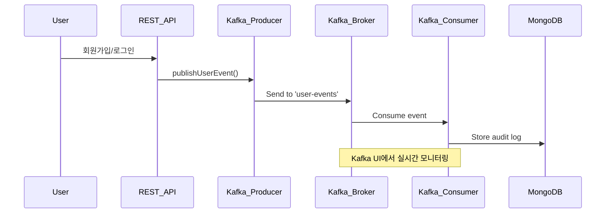
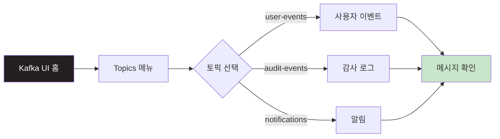
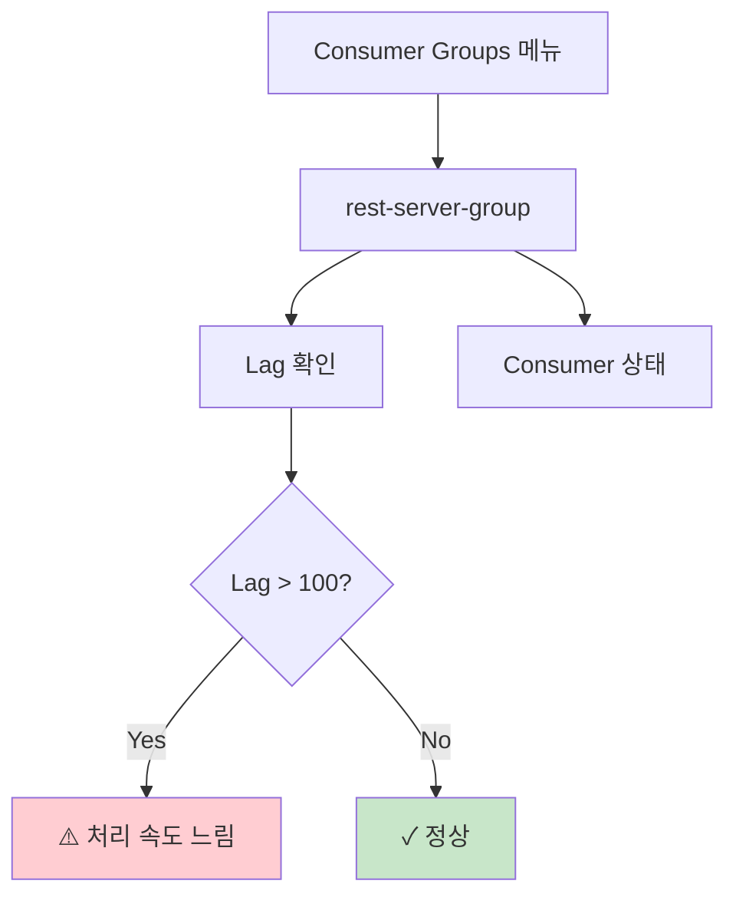
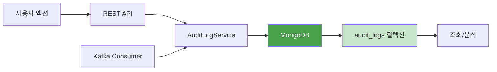
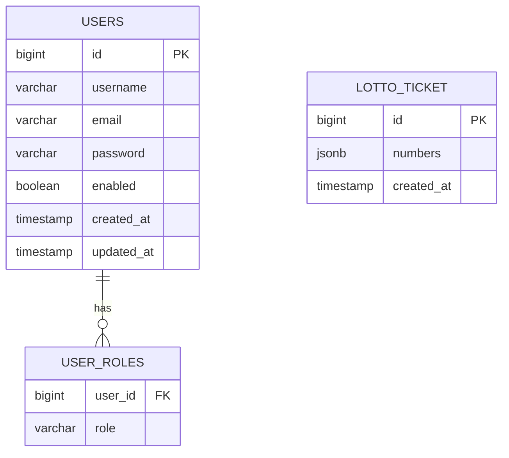
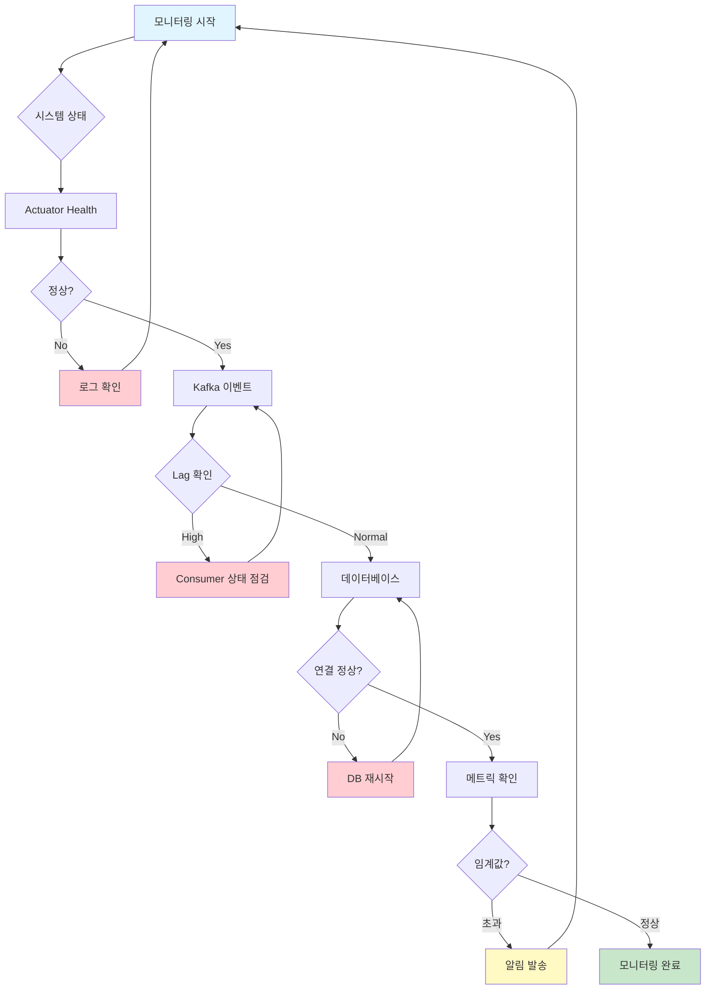
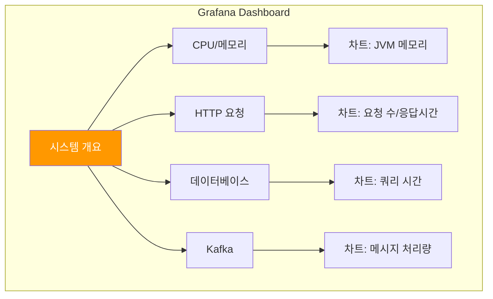

# 📊 Monitoring Guide

이 가이드는 REST Server의 모니터링 도구들을 사용하는 방법을 안내합니다.

## 📋 목차

1. [Kafka UI 모니터링](#1-kafka-ui-모니터링)
2. [Spring Actuator 모니터링](#2-spring-actuator-모니터링)
3. [MongoDB 모니터링](#3-mongodb-모니터링)
4. [PostgreSQL 모니터링](#4-postgresql-모니터링)

---

## 모니터링 아키텍처



---

## 1. Kafka UI 모니터링

### 접속 정보

**URL**: http://localhost:8090

### Kafka 이벤트 플로우



### 1-1. 토픽 확인



**확인할 토픽**:

| 토픽 | 용도 | 이벤트 예시 |
|------|------|-------------|
| `user-events` | 사용자 관련 이벤트 | USER_REGISTERED, USER_LOGGED_IN |
| `audit-events` | 감사 로그 | API_ACCESS, PERMISSION_DENIED |
| `notifications` | 알림 | WELCOME_EMAIL, PASSWORD_RESET |

### 1-2. 메시지 확인

1. **Topics** 메뉴 클릭
2. 확인할 토픽 선택 (예: `user-events`)
3. **Messages** 탭 클릭
4. 최신 메시지부터 확인

**user-events 메시지 예시**:
```json
{
  "eventId": "550e8400-e29b-41d4-a716-446655440000",
  "eventType": "USER_REGISTERED",
  "userId": 1,
  "username": "testuser",
  "email": "test@example.com",
  "timestamp": "2025-11-06T12:00:00",
  "metadata": {
    "ipAddress": "127.0.0.1",
    "userAgent": "Mozilla/5.0..."
  }
}
```

### 1-3. Consumer Groups 확인



**확인 항목**:
- Consumer Group ID: `rest-server-group`
- Lag: 처리되지 않은 메시지 수
- Offset: 현재 처리 위치

### 1-4. 실시간 모니터링

```bash
# 테스트 이벤트 발생
curl -X POST http://localhost:8080/api/v1/users/register \
  -H "Content-Type: application/json" \
  -d '{
    "username": "testuser",
    "email": "test@example.com",
    "password": "password123"
  }'

# Kafka UI에서 실시간으로 user-events 토픽 확인
# → USER_REGISTERED 이벤트 확인 가능
```

---

## 2. Spring Actuator 모니터링

### 접속 정보

**Base URL**: http://localhost:8080/actuator

### Actuator 엔드포인트 맵

```mermaid
graph TB
    A[/actuator] --> B[/health]
    A --> C[/metrics]
    A --> D[/prometheus]
    A --> E[/env]
    A --> F[/loggers]

    B --> B1[애플리케이션 상태]
    C --> C1[메트릭 정보]
    D --> D1[Prometheus 형식]
    E --> E1[환경 변수]
    F --> F1[로거 설정]

    style A fill:#6db33f,color:#fff
    style B fill:#c8e6c9
    style C fill:#c8e6c9
    style D fill:#c8e6c9
```

### 2-1. Health Check

```bash
# 기본 헬스체크
curl http://localhost:8080/actuator/health

# 상세 정보 (인증 필요)
curl http://localhost:8080/actuator/health \
  -H "Authorization: Bearer $TOKEN"
```

**응답 예시**:
```json
{
  "status": "UP",
  "components": {
    "db": {
      "status": "UP",
      "details": {
        "database": "PostgreSQL",
        "validationQuery": "isValid()"
      }
    },
    "diskSpace": {
      "status": "UP",
      "details": {
        "total": 499963174912,
        "free": 209715200000,
        "threshold": 10485760
      }
    },
    "mongo": {
      "status": "UP",
      "details": {
        "version": "7.0.0"
      }
    },
    "redis": {
      "status": "UP",
      "details": {
        "version": "7.2.0"
      }
    }
  }
}
```

### 2-2. Metrics

```bash
# 모든 메트릭 목록
curl http://localhost:8080/actuator/metrics

# 특정 메트릭 (JVM 메모리)
curl http://localhost:8080/actuator/metrics/jvm.memory.used

# 특정 메트릭 (HTTP 요청)
curl http://localhost:8080/actuator/metrics/http.server.requests
```

**주요 메트릭**:

| 메트릭 | 설명 |
|--------|------|
| `jvm.memory.used` | JVM 메모리 사용량 |
| `jvm.threads.live` | 활성 스레드 수 |
| `http.server.requests` | HTTP 요청 통계 |
| `jdbc.connections.active` | 활성 DB 연결 수 |
| `cache.gets` | 캐시 조회 통계 |

### 2-3. Prometheus Metrics

```bash
# Prometheus 형식의 모든 메트릭
curl http://localhost:8080/actuator/prometheus
```

**Prometheus 수집 설정 예시** (`prometheus.yml`):
```yaml
scrape_configs:
  - job_name: 'rest-server'
    metrics_path: '/actuator/prometheus'
    static_configs:
      - targets: ['localhost:8080']
```

---

## 3. MongoDB 모니터링

### MongoDB 데이터 플로우



### 3-1. MongoDB Shell 접속

```bash
# Docker 컨테이너 접속
docker exec -it rest-mongodb mongosh

# 또는 로컬에서 직접 접속
mongosh mongodb://localhost:27017/rest_server
```

### 3-2. Audit Log 조회

```javascript
// 데이터베이스 선택
use rest_server

// 모든 audit log 확인
db.audit_logs.find().pretty()

// 최근 10개 로그
db.audit_logs.find().sort({timestamp: -1}).limit(10).pretty()

// 특정 사용자의 로그
db.audit_logs.find({username: "testuser"}).pretty()

// OAuth2 로그인만 조회
db.audit_logs.find({eventType: "OAUTH2_LOGIN"}).pretty()

// 날짜 범위로 조회
db.audit_logs.find({
  timestamp: {
    $gte: ISODate("2025-11-06T00:00:00Z"),
    $lt: ISODate("2025-11-07T00:00:00Z")
  }
}).pretty()

// 실패한 이벤트만 조회
db.audit_logs.find({success: false}).pretty()

// 통계 - 이벤트 타입별 카운트
db.audit_logs.aggregate([
  { $group: { _id: "$eventType", count: { $sum: 1 } } },
  { $sort: { count: -1 } }
])
```

### 3-3. Audit Log 문서 구조

```json
{
  "_id": "507f1f77bcf86cd799439011",
  "eventType": "OAUTH2_LOGIN",
  "username": "testuser",
  "action": "oauth2_login",
  "resourceType": "user",
  "resourceId": "testuser",
  "ipAddress": "127.0.0.1",
  "userAgent": "Mozilla/5.0...",
  "details": {
    "provider": "google"
  },
  "timestamp": ISODate("2025-11-06T12:00:00Z"),
  "success": true,
  "errorMessage": null,
  "_class": "yousang.rest_server.adapter.out.persistence.mongo.AuditLogDocument"
}
```

---

## 4. PostgreSQL 모니터링

### 4-1. pgAdmin 접속

**URL**: http://localhost:5050

**로그인 정보**:
- Email: `admin@example.com`
- Password: `admin`

### 4-2. 서버 연결

1. **Add New Server** 클릭
2. **General** 탭:
   - Name: `REST Server DB`
3. **Connection** 탭:
   - Host: `postgres`
   - Port: `5432`
   - Database: `rest_dev`
   - Username: `postgres`
   - Password: `postgres`

### 4-3. 주요 테이블



### 4-4. 유용한 SQL 쿼리

```sql
-- 전체 사용자 수
SELECT COUNT(*) FROM users;

-- 역할별 사용자 수
SELECT role, COUNT(*)
FROM user_roles
GROUP BY role;

-- 최근 가입한 사용자 10명
SELECT username, email, created_at
FROM users
ORDER BY created_at DESC
LIMIT 10;

-- 활성 사용자 수
SELECT COUNT(*)
FROM users
WHERE enabled = true;

-- 오늘 가입한 사용자
SELECT username, email, created_at
FROM users
WHERE DATE(created_at) = CURRENT_DATE;
```

---

## 📈 통합 모니터링 대시보드

### 모니터링 체크리스트



### 모니터링 주기

| 항목 | 주기 | 도구 |
|------|------|------|
| 시스템 Health | 1분 | Actuator |
| Kafka Lag | 5분 | Kafka UI |
| DB 연결 풀 | 5분 | Actuator Metrics |
| 메모리 사용량 | 10분 | Actuator Metrics |
| Audit Log | 1시간 | MongoDB |

---

## 🚨 알람 설정

### 권장 임계값

```yaml
alerts:
  - name: high_kafka_lag
    condition: lag > 1000
    action: notify_team

  - name: low_memory
    condition: jvm.memory.used > 80%
    action: auto_scale

  - name: db_connection_pool_exhausted
    condition: jdbc.connections.active >= jdbc.connections.max
    action: notify_dba

  - name: high_error_rate
    condition: http.server.requests.error_rate > 5%
    action: notify_team
```

### Grafana 대시보드 예시



---

## 📊 모니터링 명령어 정리

```bash
# Actuator 헬스체크
curl http://localhost:8080/actuator/health

# Prometheus 메트릭
curl http://localhost:8080/actuator/prometheus

# Kafka UI
open http://localhost:8090

# MongoDB 로그
docker exec -it rest-mongodb mongosh --eval "use rest_server; db.audit_logs.find().limit(10).pretty()"

# pgAdmin
open http://localhost:5050

# 전체 서비스 상태
docker-compose ps

# 로그 확인
docker-compose logs -f rest-server
docker-compose logs -f kafka
docker-compose logs -f mongodb
```

---

**Last Updated**: 2025-11-06
**Version**: v3.0.0
