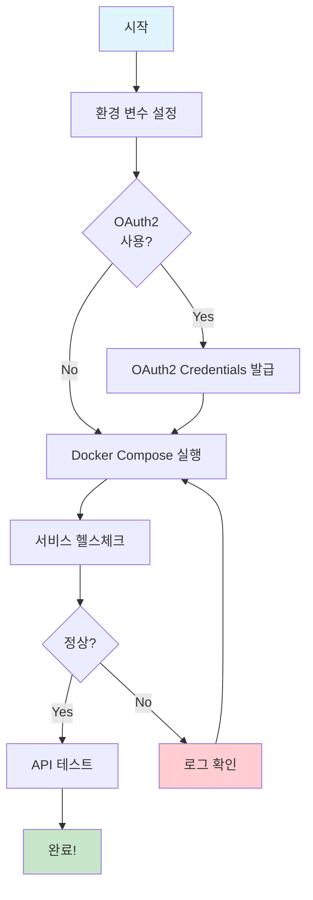
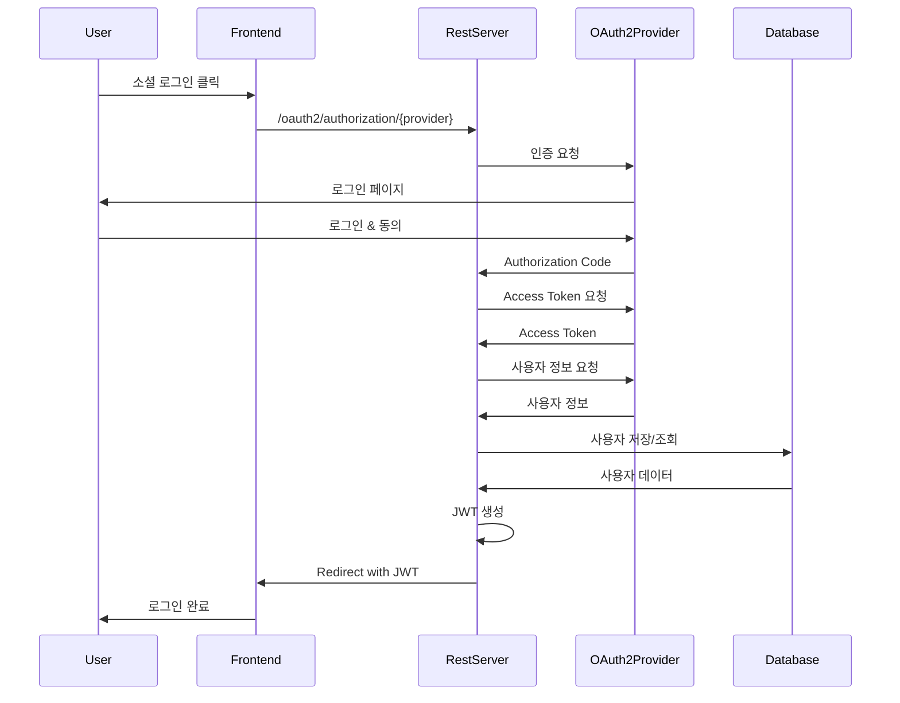
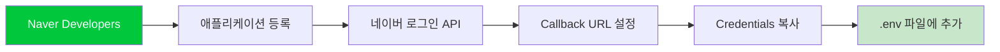
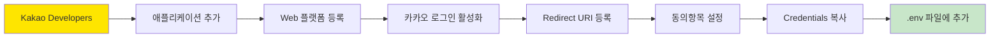
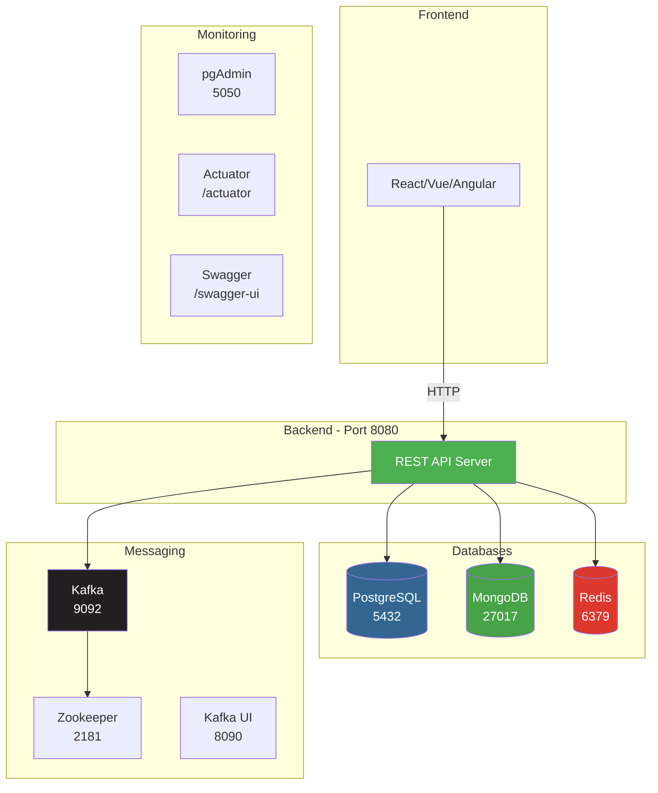
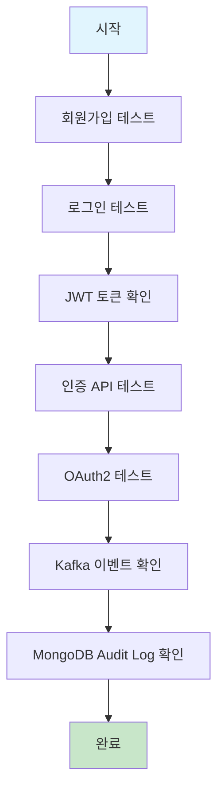
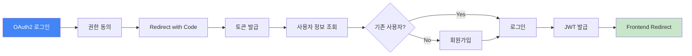
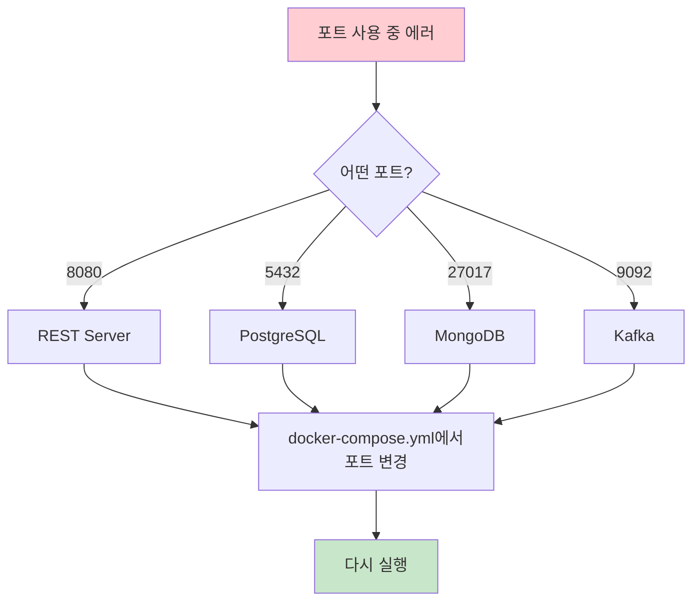

# 🚀 Quick Start Guide

이 가이드는 REST Server를 최대한 빠르게 실행하는 방법을 안내합니다.

## 📋 목차

1. [환경 설정](#1-환경-설정)
2. [OAuth2 설정](#2-oauth2-설정)
3. [서비스 실행](#3-서비스-실행)
4. [테스트](#4-테스트)

---

## 전체 플로우



---

## 1. 환경 설정

### Step 1-1: 환경 변수 설정 스크립트 실행

```bash
# 스크립트 실행 (.env 파일 생성)
./setup-oauth2-env.sh
```

이 스크립트는:
- `.env` 파일 템플릿 생성
- 환경 변수 확인 및 검증
- 현재 설정 상태 표시

### Step 1-2: .env 파일 편집

OAuth2를 사용하지 않는 경우 이 단계를 건너뛸 수 있습니다.

```bash
# .env 파일 편집
nano .env  # 또는 vi, code 등 선호하는 에디터 사용
```

---

## 2. OAuth2 설정

### OAuth2 플로우



### 2-1. Google OAuth2 설정

**필수 URL**: https://console.cloud.google.com/


**Redirect URI**:
```
http://localhost:8080/login/oauth2/code/google
```

**Scopes**:
- `email`
- `profile`

### 2-2. Naver OAuth2 설정

**필수 URL**: https://developers.naver.com/



**Callback URL**:
```
http://localhost:8080/login/oauth2/code/naver
```

**제공 정보**:
- 회원이름
- 이메일 주소

### 2-3. Kakao OAuth2 설정

**필수 URL**: https://developers.kakao.com/



**Redirect URI**:
```
http://localhost:8080/login/oauth2/code/kakao
```

**동의항목**:
- 닉네임 (필수)
- 이메일 (필수)

---

## 3. 서비스 실행

### 아키텍처 개요



### 3-1. Docker Compose 실행

```bash
# 전체 스택 실행
docker-compose up -d

# 로그 확인
docker-compose logs -f rest-server
```

### 3-2. 서비스 상태 확인

```bash
# Health Check
curl http://localhost:8080/actuator/health

# 예상 출력:
# {"status":"UP"}
```

### 3-3. 각 서비스 접속 확인

| 서비스 | URL | 설명 |
|--------|-----|------|
| 🌐 REST API | http://localhost:8080 | 메인 API |
| 📚 Swagger UI | http://localhost:8080/swagger-ui.html | API 문서 |
| 🔍 Actuator | http://localhost:8080/actuator | 모니터링 |
| 📊 Kafka UI | http://localhost:8090 | Kafka 모니터링 |
| 🗄️ pgAdmin | http://localhost:5050 | PostgreSQL 관리 |

---

## 4. 테스트

### 테스트 플로우



### 4-1. 회원가입 테스트

```bash
curl -X POST http://localhost:8080/api/v1/users/register \
  -H "Content-Type: application/json" \
  -d '{
    "username": "testuser",
    "email": "test@example.com",
    "password": "password123"
  }'
```

**예상 응답**:
```json
{
  "id": 1,
  "username": "testuser",
  "email": "test@example.com",
  "roles": ["USER"],
  "enabled": true,
  "createdAt": "2025-11-06T12:00:00",
  "updatedAt": "2025-11-06T12:00:00"
}
```

### 4-2. 로그인 테스트

```bash
curl -X POST http://localhost:8080/api/v1/auth/login \
  -H "Content-Type: application/json" \
  -d '{
    "username": "testuser",
    "password": "password123"
  }'
```

**예상 응답**:
```json
{
  "accessToken": "eyJhbGciOiJIUzI1NiIs...",
  "refreshToken": "eyJhbGciOiJIUzI1NiIs...",
  "user": {
    "id": 1,
    "username": "testuser",
    "email": "test@example.com",
    "roles": ["USER"],
    "enabled": true
  }
}
```

### 4-3. 인증 API 테스트

```bash
# 토큰 저장
TOKEN="your-access-token-here"

# 사용자 정보 조회
curl -X GET http://localhost:8080/api/v1/users/1 \
  -H "Authorization: Bearer $TOKEN"
```

### 4-4. OAuth2 로그인 테스트

브라우저에서 접속:

```
# Google
http://localhost:8080/oauth2/authorization/google

# Naver
http://localhost:8080/oauth2/authorization/naver

# Kakao
http://localhost:8080/oauth2/authorization/kakao
```

**OAuth2 로그인 후 플로우**:



### 4-5. Kafka 이벤트 확인

**Kafka UI 접속**: http://localhost:8090

확인할 토픽:
- `user-events` - 사용자 이벤트
- `audit-events` - 감사 로그
- `notifications` - 알림

### 4-6. MongoDB Audit Log 확인

```bash
# MongoDB 접속
docker exec -it rest-mongodb mongosh

# 데이터베이스 선택
use rest_server

# Audit Log 확인
db.audit_logs.find().pretty()

# 특정 사용자의 로그 확인
db.audit_logs.find({username: "testuser"}).pretty()

# OAuth2 로그인 이벤트만 확인
db.audit_logs.find({eventType: "OAUTH2_LOGIN"}).pretty()
```

---

## 🎯 주요 명령어 정리

```bash
# 환경 설정
source setup-oauth2-env.sh

# 서비스 시작
docker-compose up -d

# 서비스 중지
docker-compose down

# 로그 확인
docker-compose logs -f rest-server

# 전체 재시작
docker-compose restart

# 볼륨 포함 전체 삭제
docker-compose down -v

# 특정 서비스만 재시작
docker-compose restart rest-server
```

---

## 🐛 문제 해결

### 포트 충돌



**해결 방법**:
```bash
# 포트 사용 확인
lsof -i :8080
netstat -tuln | grep 8080

# 프로세스 종료
kill -9 <PID>
```

### 서비스 시작 실패

```bash
# 로그 확인
docker-compose logs rest-server

# 의존성 서비스 확인
docker-compose ps

# 헬스체크 확인
docker-compose exec rest-server wget --spider http://localhost:8080/actuator/health
```

### OAuth2 로그인 실패

**체크리스트**:
- [ ] Client ID/Secret이 정확한가?
- [ ] Redirect URI가 정확히 일치하는가?
- [ ] 환경 변수가 제대로 로드되었는가?
- [ ] 제공자 콘솔에서 API가 활성화되었는가?

---

## 📚 추가 자료

- [OAuth2 상세 설정 가이드](README_OAUTH2_SETUP.md)
- [엔터프라이즈 가이드](README_ENTERPRISE.md)
- [API 문서](http://localhost:8080/swagger-ui.html)

---

**Last Updated**: 2025-11-06
**Version**: v3.0.0
