# 자동 투자 시스템 (Algorithmic Trading Platform) 아키텍처

## 📋 목차
1. [시스템 개요](#시스템-개요)
2. [전체 아키텍처](#전체-아키텍처)
3. [Phase 1: 데이터 수집 인프라](#phase-1-데이터-수집-인프라)
4. [Phase 2: AI/ML 분석 엔진](#phase-2-aiml-분석-엔진)
5. [Phase 3: 자동 매매 엔진](#phase-3-자동-매매-엔진)
6. [Phase 4: 모니터링 & 알림](#phase-4-모니터링--알림)
7. [데이터 플로우](#데이터-플로우)
8. [보안 & 리스크 관리](#보안--리스크-관리)
9. [배포 전략](#배포-전략)
10. [API 명세](#api-명세)

---

## 시스템 개요

### 비전
**실시간 글로벌 데이터 기반 지능형 자동 투자 플랫폼**

전 세계 뉴스, SNS, 경제 지표, 시장 데이터를 실시간으로 수집·분석하여 AI/ML 기반 예측과 전략으로 자동 매수/매도를 실행하는 엔터프라이즈급 트레이딩 시스템.

### 핵심 기능
- ✅ **실시간 다중 소스 데이터 수집**: 뉴스, SNS, 거래소, 경제 지표
- ✅ **AI/ML 분석**: 감성 분석, 가격 예측, 연관성 분석
- ✅ **자동 매매**: 다중 전략 엔진, 리스크 관리, 백테스팅
- ✅ **인터랙티브 알림**: Telegram Bot (버튼 UI), Slack 통합
- ✅ **실시간 모니터링**: Grafana 대시보드, 성과 분석

### 기술 스택
| 카테고리 | 기술 |
|---------|------|
| **Backend** | Kotlin + Spring Boot 3.2 + Java 21 Virtual Threads |
| **AI/ML** | Python FastAPI + TensorFlow/PyTorch + Hugging Face |
| **Database** | PostgreSQL (거래 데이터) + MongoDB (비정형 데이터) + Redis (캐시) |
| **Streaming** | Apache Kafka (실시간 이벤트 스트리밍) |
| **Messaging** | Telegram Bot API + Slack Webhook |
| **Monitoring** | Prometheus + Grafana + Spring Boot Actuator |
| **Container** | Docker + Kubernetes (AWS EKS) |

---

## 전체 아키텍처

### 시스템 컨텍스트 다이어그램

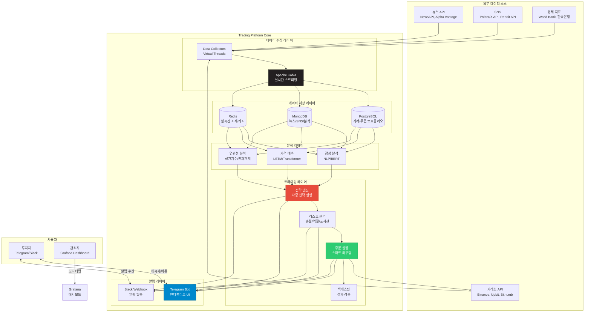

### 레이어별 책임

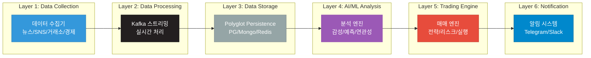

---

## Phase 1: 데이터 수집 인프라

### 1-1. 도메인 모델 설계

#### 뉴스 도메인

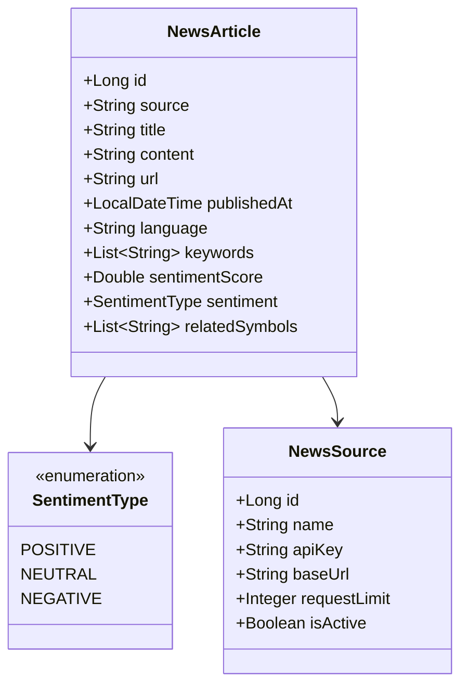

#### 거래소 도메인

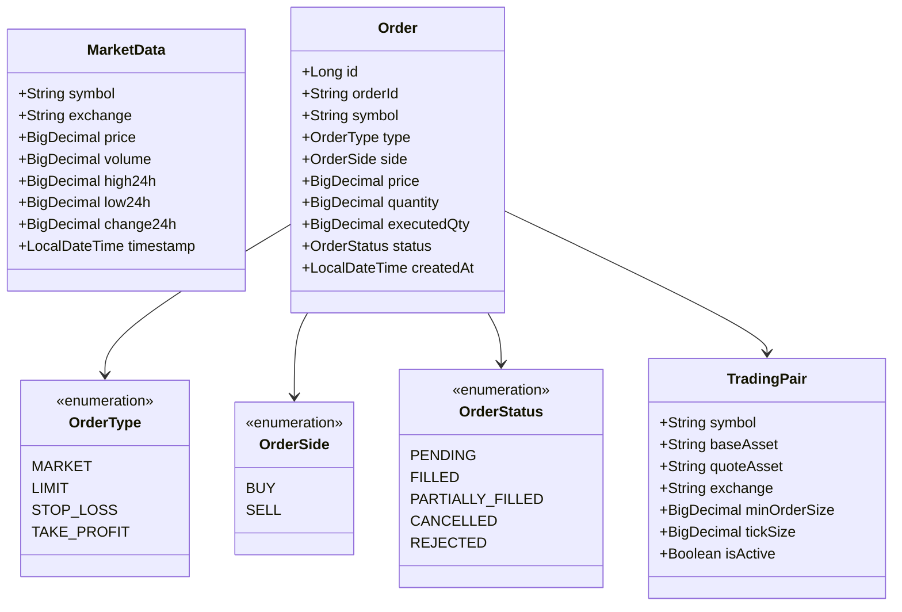

### 1-2. Kafka 토픽 설계

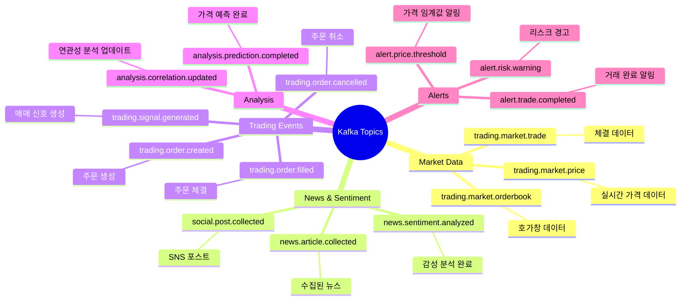

### 1-3. 데이터베이스 스키마

#### PostgreSQL (관계형 데이터)

```sql
-- 거래 쌍 정보
CREATE TABLE trading_pairs (
    id BIGSERIAL PRIMARY KEY,
    symbol VARCHAR(20) NOT NULL UNIQUE,
    base_asset VARCHAR(10) NOT NULL,
    quote_asset VARCHAR(10) NOT NULL,
    exchange VARCHAR(50) NOT NULL,
    min_order_size DECIMAL(20, 8),
    tick_size DECIMAL(20, 8),
    is_active BOOLEAN DEFAULT true,
    created_at TIMESTAMP DEFAULT CURRENT_TIMESTAMP,
    INDEX idx_symbol_exchange (symbol, exchange)
);

-- 주문 내역
CREATE TABLE orders (
    id BIGSERIAL PRIMARY KEY,
    order_id VARCHAR(100) NOT NULL,
    user_id BIGINT NOT NULL,
    symbol VARCHAR(20) NOT NULL,
    exchange VARCHAR(50) NOT NULL,
    order_type VARCHAR(20) NOT NULL,
    order_side VARCHAR(10) NOT NULL,
    price DECIMAL(20, 8),
    quantity DECIMAL(20, 8) NOT NULL,
    executed_qty DECIMAL(20, 8) DEFAULT 0,
    status VARCHAR(20) NOT NULL,
    strategy_id BIGINT,
    created_at TIMESTAMP DEFAULT CURRENT_TIMESTAMP,
    updated_at TIMESTAMP DEFAULT CURRENT_TIMESTAMP,
    INDEX idx_user_symbol (user_id, symbol),
    INDEX idx_status (status),
    INDEX idx_created_at (created_at)
);

-- 포트폴리오
CREATE TABLE portfolios (
    id BIGSERIAL PRIMARY KEY,
    user_id BIGINT NOT NULL,
    symbol VARCHAR(20) NOT NULL,
    quantity DECIMAL(20, 8) NOT NULL,
    avg_buy_price DECIMAL(20, 8),
    current_price DECIMAL(20, 8),
    unrealized_pnl DECIMAL(20, 8),
    updated_at TIMESTAMP DEFAULT CURRENT_TIMESTAMP,
    UNIQUE(user_id, symbol)
);

-- 거래 전략
CREATE TABLE trading_strategies (
    id BIGSERIAL PRIMARY KEY,
    user_id BIGINT NOT NULL,
    name VARCHAR(100) NOT NULL,
    strategy_type VARCHAR(50) NOT NULL,
    config JSONB NOT NULL,
    is_active BOOLEAN DEFAULT false,
    created_at TIMESTAMP DEFAULT CURRENT_TIMESTAMP,
    updated_at TIMESTAMP DEFAULT CURRENT_TIMESTAMP
);

-- 백테스팅 결과
CREATE TABLE backtest_results (
    id BIGSERIAL PRIMARY KEY,
    strategy_id BIGINT NOT NULL,
    start_date TIMESTAMP NOT NULL,
    end_date TIMESTAMP NOT NULL,
    initial_capital DECIMAL(20, 8) NOT NULL,
    final_capital DECIMAL(20, 8) NOT NULL,
    total_return DECIMAL(10, 4),
    sharpe_ratio DECIMAL(10, 4),
    max_drawdown DECIMAL(10, 4),
    win_rate DECIMAL(10, 4),
    total_trades INTEGER,
    created_at TIMESTAMP DEFAULT CURRENT_TIMESTAMP
);
```

#### MongoDB (비정형 데이터)

```javascript
// 뉴스 기사 컬렉션
db.news_articles.createIndex({ "publishedAt": -1 });
db.news_articles.createIndex({ "relatedSymbols": 1 });
db.news_articles.createIndex({ "sentiment": 1 });

{
  _id: ObjectId,
  source: "Reuters",
  title: "Bitcoin surges to new high",
  content: "...",
  url: "https://...",
  publishedAt: ISODate("2025-11-08T10:00:00Z"),
  language: "en",
  keywords: ["bitcoin", "cryptocurrency", "surge"],
  sentimentScore: 0.85,
  sentiment: "POSITIVE",
  relatedSymbols: ["BTC/USDT", "ETH/USDT"],
  analyzedAt: ISODate("2025-11-08T10:01:00Z")
}

// SNS 포스트 컬렉션
db.social_posts.createIndex({ "createdAt": -1 });
db.social_posts.createIndex({ "platform": 1, "author": 1 });

{
  _id: ObjectId,
  platform: "twitter",
  author: "elonmusk",
  content: "Dogecoin to the moon!",
  url: "https://twitter.com/...",
  likes: 50000,
  retweets: 10000,
  createdAt: ISODate("2025-11-08T09:00:00Z"),
  sentimentScore: 0.92,
  sentiment: "POSITIVE",
  relatedSymbols: ["DOGE/USDT"]
}

// 시장 데이터 (1분봉)
db.market_candles.createIndex({ "symbol": 1, "timestamp": -1 });
db.market_candles.createIndex({ "exchange": 1, "timestamp": -1 });

{
  _id: ObjectId,
  symbol: "BTC/USDT",
  exchange: "binance",
  interval: "1m",
  timestamp: ISODate("2025-11-08T10:00:00Z"),
  open: 45000.00,
  high: 45500.00,
  low: 44800.00,
  close: 45200.00,
  volume: 123.45
}
```

#### Redis (캐시 & 실시간 데이터)

```
# 실시간 가격
price:{symbol}:{exchange} → {"price": 45000, "timestamp": 1699437600}
TTL: 60초

# 뉴스 감성 점수 (최근 1시간)
sentiment:news:{symbol}:1h → 0.75
TTL: 3600초

# 거래 전략 상태
strategy:{strategyId}:status → "RUNNING"
TTL: 무제한 (명시적 삭제)

# Rate Limiting
ratelimit:api:{userId}:{endpoint} → 100
TTL: 60초

# 실시간 포트폴리오
portfolio:{userId} → {"BTC": 0.5, "ETH": 10.0}
TTL: 300초
```

### 1-4. 데이터 수집기 구현 구조

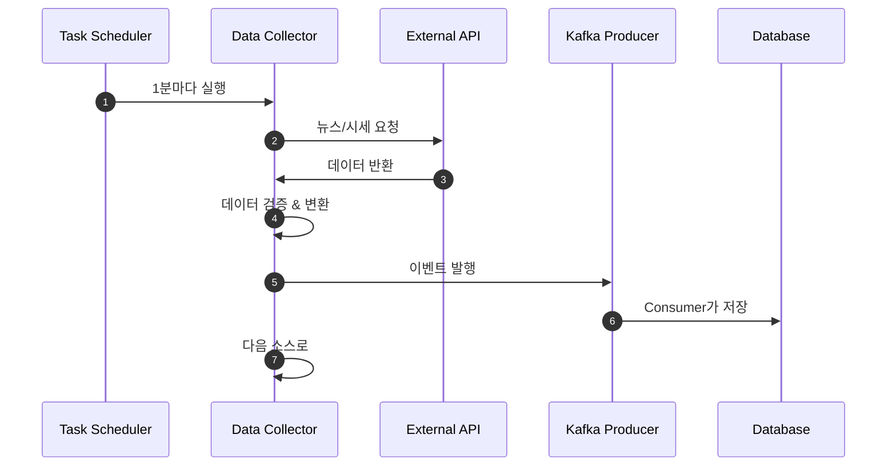

---

## Phase 2: AI/ML 분석 엔진

### 2-1. 감성 분석 아키텍처

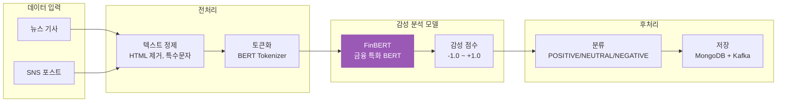

**모델**: FinBERT (금융 도메인 특화 BERT)
- Hugging Face: `ProsusAI/finbert`
- 입력: 뉴스 제목 + 본문 (최대 512 토큰)
- 출력: 감성 점수 (-1.0 ~ +1.0) + 라벨 (positive/neutral/negative)

### 2-2. 가격 예측 아키텍처

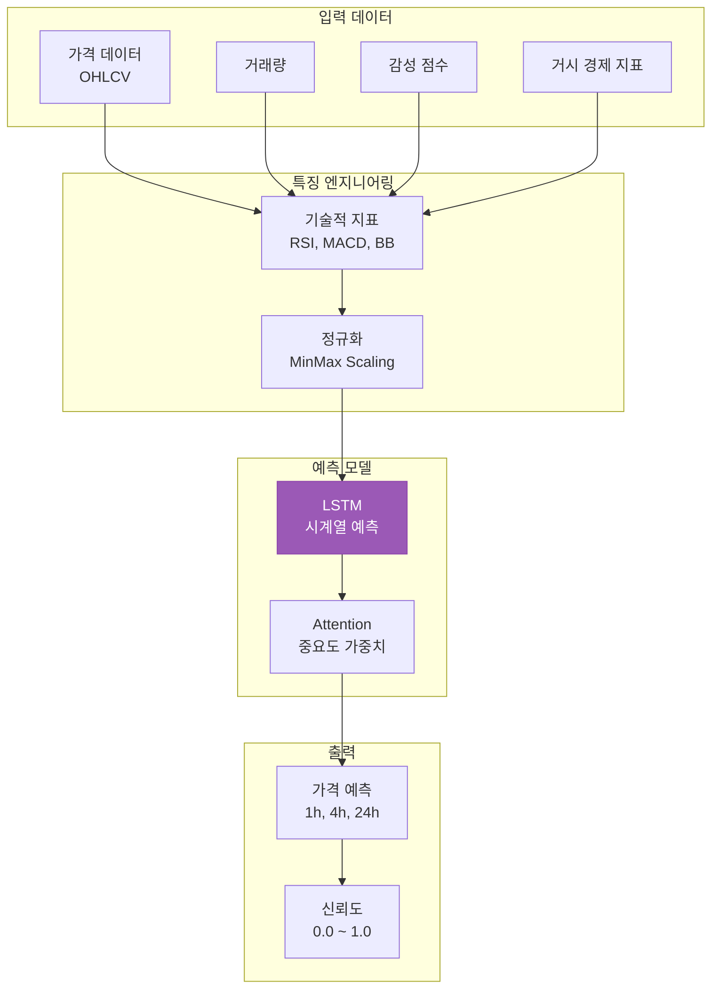

**모델**: LSTM + Attention Mechanism
- 입력: 과거 168시간 (7일) 데이터
- 특징: OHLCV + 기술적 지표 (20개) + 감성 점수
- 출력: 1시간, 4시간, 24시간 후 가격 예측 + 신뢰도

### 2-3. 연관성 분석

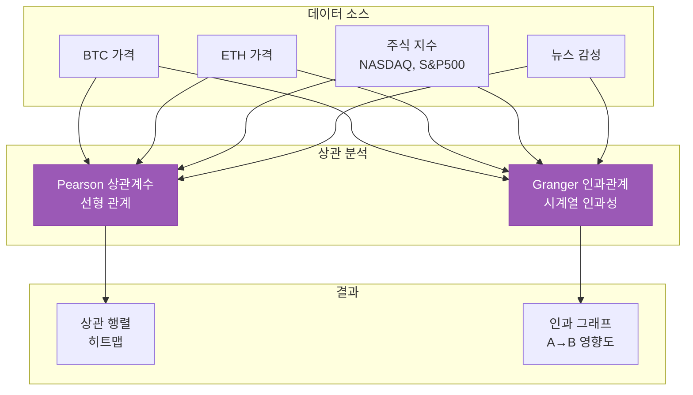

---

## Phase 3: 자동 매매 엔진

### 3-1. 트레이딩 전략 엔진

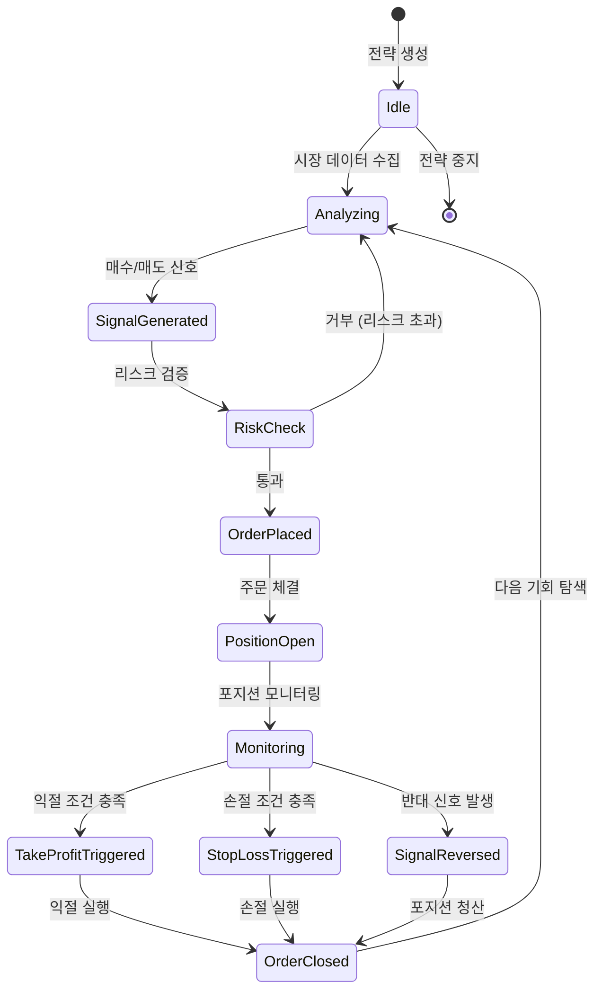

**지원 전략 타입**:
1. **Sentiment-Based**: 뉴스/SNS 감성 기반
2. **Technical**: 기술적 지표 (RSI, MACD, Bollinger Bands)
3. **ML-Prediction**: 머신러닝 가격 예측 기반
4. **Hybrid**: 복합 전략 (감성 + 기술적 + 예측)
5. **Arbitrage**: 거래소간 차익거래

### 3-2. 리스크 관리 시스템

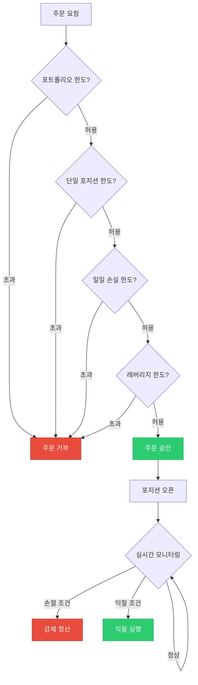

**리스크 파라미터**:
- **최대 포지션 크기**: 포트폴리오의 10%
- **손절 (Stop Loss)**: 진입가 대비 -5%
- **익절 (Take Profit)**: 진입가 대비 +15%
- **일일 최대 손실**: 총 자산의 -3%
- **최대 동시 포지션**: 5개
- **레버리지**: 최대 3x (선물 거래 시)

### 3-3. 주문 실행 시스템

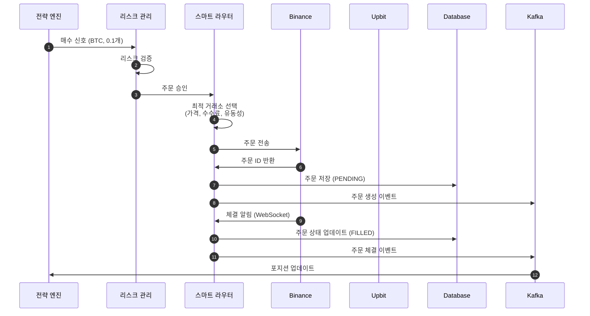

**스마트 오더 라우팅**:
- 거래소별 실시간 가격 비교
- 수수료 최적화
- 유동성 체크 (Slippage 최소화)
- Fallback: 1순위 거래소 실패 시 2순위로 자동 전환

### 3-4. 백테스팅 프레임워크

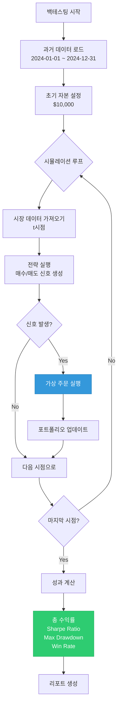

**백테스팅 메트릭**:
- **Total Return**: (최종 자산 - 초기 자산) / 초기 자산
- **Sharpe Ratio**: (평균 수익률 - 무위험 수익률) / 수익률 표준편차
- **Max Drawdown**: 최고점 대비 최대 하락률
- **Win Rate**: 수익 거래 수 / 전체 거래 수
- **Average Trade**: 거래당 평균 손익

---

## Phase 4: 모니터링 & 알림

### 4-1. Telegram Bot 아키텍처

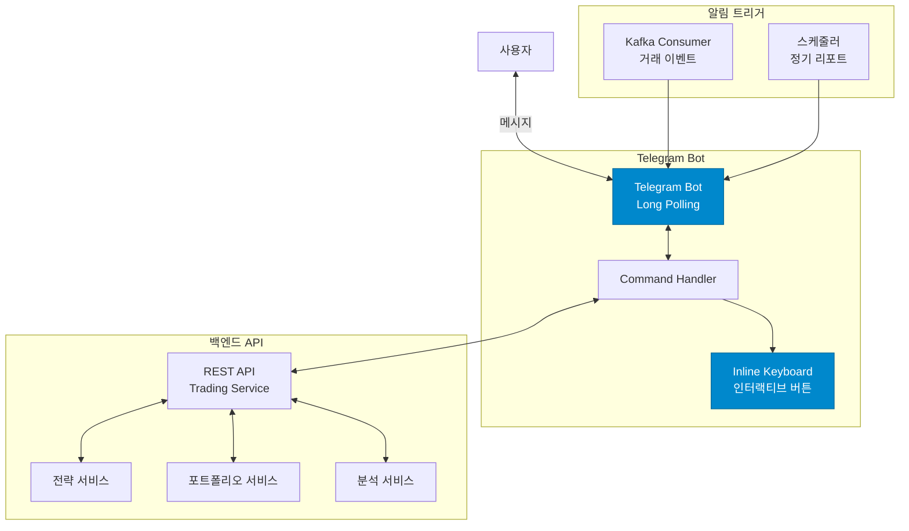

#### Telegram Bot 기능

**1. 인터랙티브 메뉴 (Inline Keyboard)**

```
┌─────────────────────────────┐
│  자동투자 시스템 Bot        │
├─────────────────────────────┤
│  📊 현재 시황 분석          │
│  💼 내 포트폴리오           │
│  🎯 전략 관리               │
│  📈 실시간 차트              │
│  ⚙️ 설정                    │
└─────────────────────────────┘
```

**2. 전략 관리 메뉴**

```
┌─────────────────────────────┐
│  전략 관리                   │
├─────────────────────────────┤
│  ▶️ 자동매매 시작           │
│  ⏸️ 자동매매 일시정지        │
│  ⏹️ 자동매매 중지           │
│  ➕ 새 전략 추가            │
│  📋 전략 목록 보기           │
└─────────────────────────────┘
```

**3. 실시간 알림 예시**

```
🔔 주문 체결 알림
───────────────
심볼: BTC/USDT
거래소: Binance
타입: 매수 (MARKET)
수량: 0.05 BTC
가격: $45,000
총액: $2,250

전략: Sentiment Strategy
시간: 2025-11-08 10:30:15

[포트폴리오 보기] [차트 보기]
```

**4. 시황 분석 리포트**

```
📊 현재 시황 분석
───────────────
🪙 BTC/USDT: $45,200 (+2.3%)

📰 뉴스 감성: 긍정 (0.78)
- "Bitcoin surges..." (+0.85)
- "Institutions buy..." (+0.92)

🤖 AI 예측:
- 1시간 후: $45,800 (신뢰도 75%)
- 24시간 후: $47,000 (신뢰도 62%)

📈 기술적 지표:
- RSI: 68 (과매수 근접)
- MACD: 골든크로스

💡 추천: 매수 신호 (강도: 8/10)

[자동매매 시작] [더보기]
```

#### 주요 명령어

| 명령어 | 설명 |
|-------|------|
| `/start` | 봇 시작 및 메인 메뉴 |
| `/status` | 현재 시스템 상태 |
| `/portfolio` | 포트폴리오 조회 |
| `/strategies` | 전략 목록 |
| `/start_trading [전략ID]` | 자동매매 시작 |
| `/stop_trading [전략ID]` | 자동매매 중지 |
| `/analysis [심볼]` | 종목 분석 |
| `/backtest [전략ID]` | 백테스팅 실행 |
| `/report daily|weekly` | 성과 리포트 |
| `/settings` | 알림 설정 |

### 4-2. Slack 알림 통합

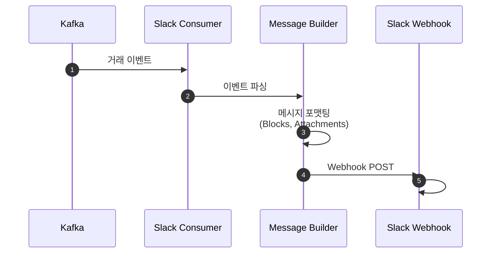

**Slack 알림 타입**:
- ✅ **주문 체결**: 매수/매도 완료 시
- ⚠️ **리스크 경고**: 손절 임박, 일일 손실 한도 근접
- 📊 **일일 리포트**: 매일 오후 6시 자동 발송
- 🚨 **긴급 알림**: 급등락, 시스템 오류

**Slack 메시지 예시**:
```json
{
  "blocks": [
    {
      "type": "header",
      "text": {
        "type": "plain_text",
        "text": "🎯 매수 주문 체결"
      }
    },
    {
      "type": "section",
      "fields": [
        {"type": "mrkdwn", "text": "*심볼:*\nBTC/USDT"},
        {"type": "mrkdwn", "text": "*가격:*\n$45,000"},
        {"type": "mrkdwn", "text": "*수량:*\n0.05 BTC"},
        {"type": "mrkdwn", "text": "*총액:*\n$2,250"}
      ]
    },
    {
      "type": "section",
      "text": {
        "type": "mrkdwn",
        "text": "*전략:* Sentiment Strategy\n*신뢰도:* 85%"
      }
    },
    {
      "type": "actions",
      "elements": [
        {
          "type": "button",
          "text": {"type": "plain_text", "text": "포트폴리오 보기"},
          "url": "https://dashboard.example.com/portfolio"
        }
      ]
    }
  ]
}
```

### 4-3. Grafana 대시보드

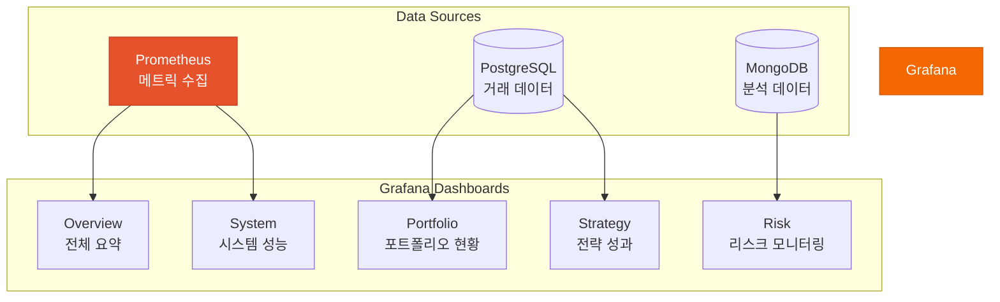

**주요 대시보드**:

1. **Overview Dashboard**
   - 총 자산 (실시간)
   - 일일/주간/월간 수익률
   - 활성 전략 수
   - 오픈 포지션 수
   - 최근 거래 내역

2. **Portfolio Dashboard**
   - 자산 분포 (파이 차트)
   - 종목별 수익률
   - 미실현 손익
   - 실현 손익 추이

3. **Strategy Performance Dashboard**
   - 전략별 수익률 비교
   - Win Rate
   - Sharpe Ratio
   - Max Drawdown
   - 거래 빈도

4. **Risk Monitoring Dashboard**
   - 실시간 리스크 레벨
   - 포지션 크기 분포
   - 레버리지 사용률
   - 손절/익절 실행 내역

5. **System Performance Dashboard**
   - API 응답 시간
   - Kafka Lag
   - JVM 메모리 사용률
   - 데이터베이스 연결 수

---

## 데이터 플로우

### 실시간 트레이딩 플로우

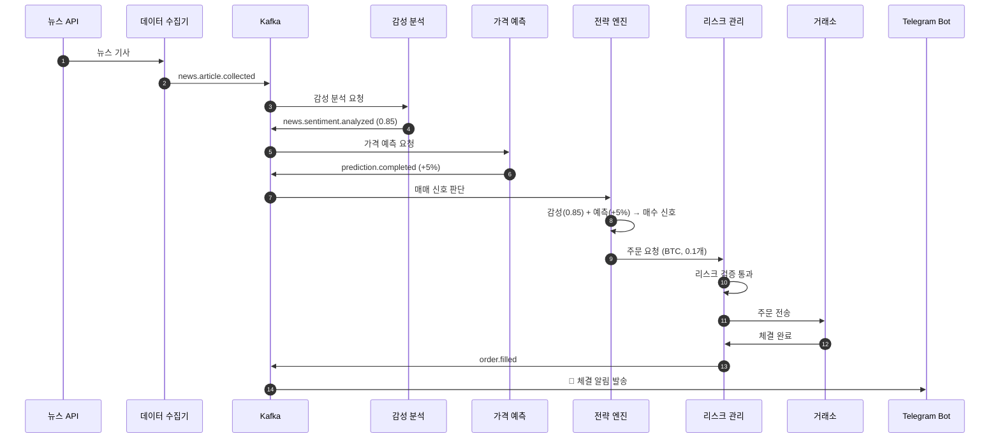

---

## 보안 & 리스크 관리

### 보안 설계

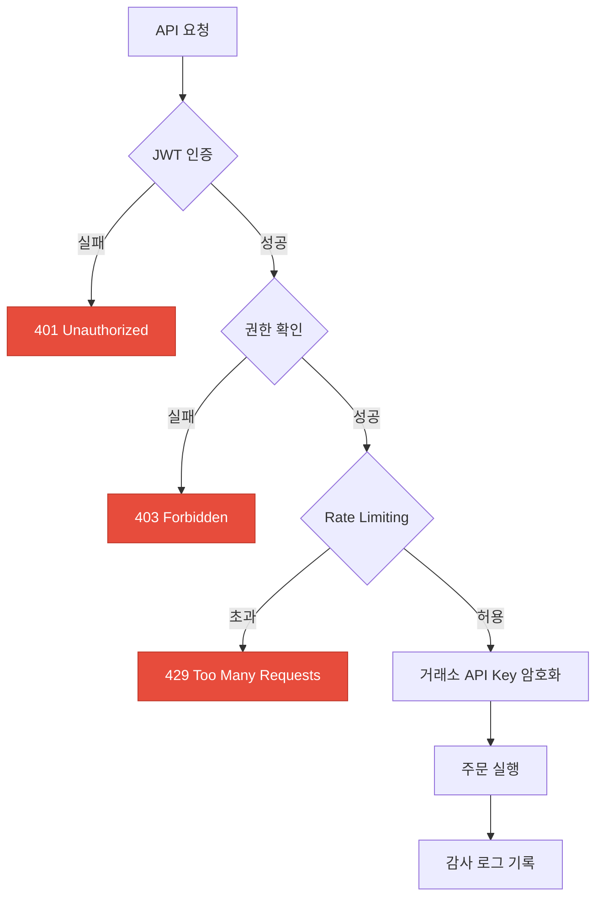

**보안 기능**:
- ✅ **API Key 암호화**: AES-256으로 거래소 API Key 저장
- ✅ **2FA**: Google Authenticator 통합
- ✅ **IP Whitelist**: 허용된 IP에서만 접근
- ✅ **감사 로그**: 모든 거래 기록 MongoDB에 저장
- ✅ **자동 로그아웃**: 비활동 30분 후
- ✅ **주문 확인**: 대량 주문 시 추가 인증

### 재해 복구 전략

- **RTO**: 5분 이내
- **RPO**: 1분 이내
- **백업**: PostgreSQL 매시간 백업, MongoDB 실시간 복제
- **Failover**: 거래소 API 장애 시 자동 대체 거래소로 전환

---

## 배포 전략

### Kubernetes 배포

```yaml
# Trading System Pods
- rest-server: 3-10 pods (HPA)
- ml-service: 2-5 pods (GPU)
- telegram-bot: 1 pod
- kafka: 3 brokers
- postgresql: 1 primary + 2 replicas
- mongodb: 3 replicas
- redis: 1 master + 2 replicas
```

### 환경별 설정

| 환경 | 용도 | 자동매매 |
|-----|------|---------|
| **dev** | 개발/테스트 | 비활성 (Paper Trading) |
| **staging** | 통합 테스트 | Paper Trading (모의 거래) |
| **prod** | 실제 운영 | 활성 (실제 거래) |

---

## API 명세

### 1. 시장 분석 API

```http
GET /api/v1/analysis/sentiment/{symbol}
Response: {
  "symbol": "BTC/USDT",
  "sentiment": "POSITIVE",
  "score": 0.85,
  "sources": [
    {"source": "Reuters", "score": 0.92},
    {"source": "Bloomberg", "score": 0.78}
  ]
}

GET /api/v1/analysis/prediction/{symbol}
Response: {
  "symbol": "BTC/USDT",
  "currentPrice": 45000,
  "predictions": {
    "1h": {"price": 45800, "confidence": 0.75},
    "24h": {"price": 47000, "confidence": 0.62}
  }
}

GET /api/v1/analysis/correlation?symbols=BTC,ETH,NASDAQ
Response: {
  "correlations": {
    "BTC-ETH": 0.92,
    "BTC-NASDAQ": 0.45
  }
}
```

### 2. 트레이딩 전략 API

```http
POST /api/v1/strategies
Request: {
  "name": "Sentiment Strategy",
  "type": "SENTIMENT_BASED",
  "symbols": ["BTC/USDT", "ETH/USDT"],
  "config": {
    "buyThreshold": 0.7,
    "sellThreshold": 0.3,
    "stopLoss": 0.05,
    "takeProfit": 0.15
  }
}

POST /api/v1/strategies/{id}/start
Response: {"status": "RUNNING"}

POST /api/v1/strategies/{id}/stop
Response: {"status": "STOPPED"}

GET /api/v1/strategies/{id}/performance
Response: {
  "totalReturn": 0.45,
  "sharpeRatio": 1.8,
  "maxDrawdown": 0.15,
  "winRate": 0.62
}
```

### 3. 포트폴리오 API

```http
GET /api/v1/portfolio
Response: {
  "totalValue": 12500.50,
  "positions": [
    {
      "symbol": "BTC/USDT",
      "quantity": 0.25,
      "avgBuyPrice": 42000,
      "currentPrice": 45000,
      "unrealizedPnL": 750.00
    }
  ]
}
```

### 4. 백테스팅 API

```http
POST /api/v1/backtest
Request: {
  "strategyId": 123,
  "startDate": "2024-01-01",
  "endDate": "2024-12-31",
  "initialCapital": 10000
}
Response: {
  "totalReturn": 0.45,
  "sharpeRatio": 1.8,
  "maxDrawdown": 0.15,
  "winRate": 0.62,
  "totalTrades": 150
}
```

---

## 다음 단계

1. ✅ Phase 1 구현 시작 (데이터 수집 인프라)
2. ✅ Phase 2 구현 (AI/ML 분석 엔진)
3. ✅ Phase 3 구현 (자동 매매 엔진)
4. ✅ Phase 4 구현 (Telegram Bot + Slack)
5. 📊 통합 테스트 & Paper Trading
6. 🚀 프로덕션 배포

---

**작성일**: 2025-11-08
**버전**: v1.0.0
**작성자**: Trading System Team
